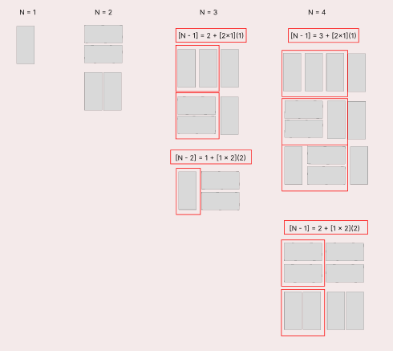

### 문제
2×n 크기의 직사각형을 1×2, 2×1 타일로 채우는 방법의 수를 구하는 프로그램을 작성하시오.
아래 그림은 2×5 크기의 직사각형을 채운 한 가지 방법의 예이다.


### 입력
첫째 줄에 n이 주어진다. (1 ≤ n ≤ 1,000)

### 출력
첫째 줄에 2×n 크기의 직사각형을 채우는 방법의 수를 10,007로 나눈 나머지를 출력한다.

## 문제풀이법
1. 테이블 정의
2. 점화식 찾기
3. 초기값 정하기

1. 테이블정의
D[i] = 2 x i 크기의 직사각형을 1x2, 2x1 타일로 채우는 방법

2. 점화식 찾기
D[i] = D[i - 1] + D[i -2]

3. D[0] = D[1] = 1; 

이 문제는 그림을 그려보면 쉽게 해결할 수 있다.   
먼저 N = 1 일때는 방법의 수는 1개이다.  2 x1 로 채울수 있는 방법은 세로 타일 하나만 가능하기 때문이다.   
두 번째로 N = 2 일때는 2가지 방법이 있다. 가로 타일 2개 또는 세로 타일 2개   
여기서 부터 중요하다.   
N = 3 일 때를 살펴보면 N = 2 일때의 타일에 세로 타일을 하나 추가한 방법의 수 +    
N = 1 일때의 타일에 가로 타일 2개를 추가한 방법의 수를 합한 방법의 수와 같다.   
다음으로 N = 4 일때를 살펴보면 동일하게 N = 3 일때의 방법의 수에 세로 타일을 하나 추가하 방법의 수 +    
N = 2 일때의 방법의 수에 가로 타일 2개를 합한 방법의 수와 같다.   

#### 어떻게 규칙을 찾을 수 있었을까?
생각해보면 간단하다. N = 1[2 x 1 (가로1칸)] 일때 타일의 방법의 수는 가로 1칸을 채울 수 있는 방법 1개만 존재한다.   
다음으로 N = 2[2 x 2(가로2칸)] 일때를 확인하면 가로 2칸을 채울 수 있는 세로타일 2개 또는 가로타일 2개이다.   
N = 3 [2 x 3(가로3칸)] 일 때 가로 3칸을 채울 수 있는 방법을 생각해보면 N = 2 (가로2칸) 에 가로 1칸을 채울 수 있는 세로 타일을   
붙이게 되면 [2 x 3]을 채울 수 있다. 또 다른 방법으로 [2 x 3] 칸을 채울 수 있는 방법은 N = 1일때 (가로1칸)을 가로 2칸을 채울 수 있는   
가로 타일을 2개 붙이게 되면 [2 x 3] 을 채울 수 있다.     
N = 4[2 x 4 (가로4칸)]도 위와 동일하게 N = 3 (가로3칸)에 가로 1칸을 채울 수 있는 세로 타입을 붙이게 되면 된다. 또 다른 방법으로는 N = 2(가로2칸)일 때에    
가로 2칸을 채우면 [2 x 4] 를 채울 수 있다. 이러한 규칙을 보면 아래와 같은 점화식을 세울 수 있다.   
**T[N] = T[N - 1] + T[N - 2]**.  


- N을 입력받는다.
- memoization을 위해 static 영역에 dp[]을 만든다.
  - 크기가 N + 1인 이유는 입력값이 1 ~ 1000인데, 인덱스 값은 0부터 시작이기때문에 + 1을 해준다.
```java
static Integer[] dp;

BufferedReader br = new BufferedReader(new InputStreamReader(System.in));
int N = Integer.parseInt(br.readLine());
dp = new Integer[N + 1];
```
- 다음으로는 초기값을 설정한다.
  - dp[0] = dp[1] = 1;
    - 여기서 dp[2] = 2;를 하지 않는 이유는 아래와같다.
    -  1<=N<= 1000 인 상황에서 n = 1을 입력하면 dp배열의 크기는 2가 된다.  
    - 다시말해 index =0, index = 1; 에만 접근이 가능하다 하지만 이 상황에 dp[2]를  
    - 접근하려 할 때 범위에 벗어나는 index에 접근하려 하니 오류가 발생하기 때문이다.
```java
dp[0] = dp[1] = 1;
```
- dp 배열에 값을 담을 재귀함수를 호출한다.
```java
System.out.println(recur(N));


private static int recur(int n) {
    if(dp[n] == null) {
        dp[n] = (recur(n - 1) + recur(n - 2)) % 10007;
    }
    return dp[n];
}
```