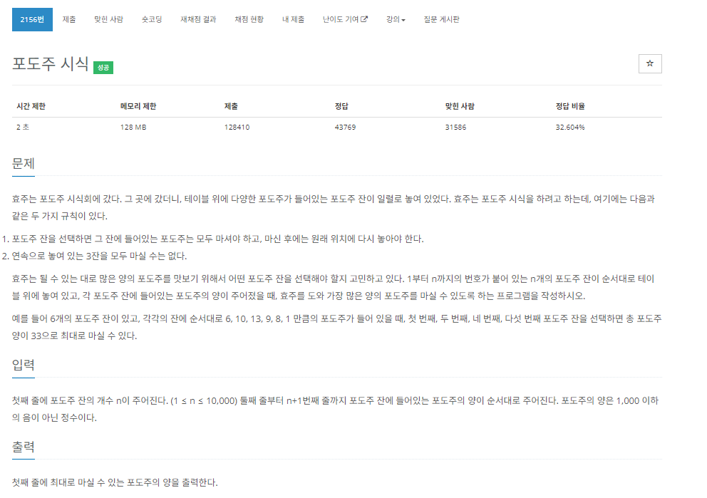
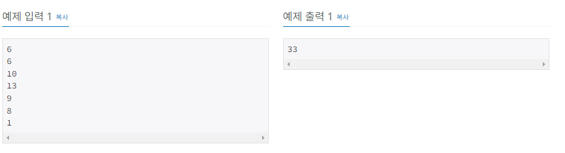

이 문제는 간단하게 보자면, N에 도달하기 위한 몇 가지 조건들 중에서 가장 큰 수를 뽑는 것 이다. 여기서는 몇가지 규칙이 있는데
1. 마지막 N번 째 포도주를 마실 필요가 없다.
2. 연속으로 놓여진 3잔을 모두 마실 수 없다.

마지막 N번 째 포도주를 마실 필요가 없다는 이유는, 문제의 마지막 부분에 가각의 잔에 순서대로 놓여진 포도주를 마시는 방법을 소개할 때 알 수 있다.

이 규칙들을 가지고 N에 도달하기 위한 몇 가지 조건들을 세워보자면 아래와 같다.
여기서 말하는 "N에 도달하기 위한"이 문제에서는 반드시 N에 도달할 필요는 없다.
[N - 1 까지만 도달해도 된다.]

1. N번 째 포도주와, N-1번 째 포도주를 마시고, N - 3 까지의 누적 최대합을 더하는 것
2. N번 째 포도주를 마시고, N - 2 까지의 누적 최대합을 더하는 것
3. N번 째 포도주를 마시지 않고, N -1 까지의 누적 최대합을 더하는 것

규칙들을 코드로 나타내 보자면
1. wines[N] + wines[N -1] + dp[N -3]
2. wines[N] + dp[N -2]
3. dp[N - 1]

이렇게 나눈 이유는 첫 번째로는 연속으로 놓여진 3잔을 모두 마실수 없다. 그렇다면 최대한으로 마실 수 있는 잔의 수는 2잔인데, 만약 N을 마신다면 N - 1을 마신 후, N - 2는 못 마실것이다.
그말은 N - 3 잔 부터는 다시 마실 수 있다는 뜻이되고, N을 마신 후 N - 1을 마시지 않는다면 N - 2부터 다시 마실 수 있다는 것이다.  위의 말대로 만들어진 규칙이 1번 2번이 된다.   
마지막으로 N을 마시지 않은경우 N - 1 까지의 최대값을 구한게 규칙이 될 것이다.

여기서 의문이 들 수 있는데, 그렇다면 N을 마시지 않고, N -1 을 마시고 한번 건너 뛴 N - 3 의 최대값을 더하면 되지 않을까? [wines[N - 1] + dp[N - 3]] 라는 생각이 들 수 있다.  
여기서 생각을 해보면 dp에는 N - 3 까지 오면서 마실 수 있는 최대값을 선택하면서 왔을 것이다. 그런데 이 선택에 있어서 wines[N - 3]을 마셨을 수도, 마시지 않았을 수도 있다. 그렇기 때문에 N -2 를 건너뛰고 N -1 을 마시는 것은 최대가 되지 않을수도 있는 것이다. 따라서 dp[N - 1] 이란 규칙이 나온것이다. dp[N - 1]는 N - 1까지 오면서 선택할 수 있는 최대값을 선택하면서 왔기 때문이다. 