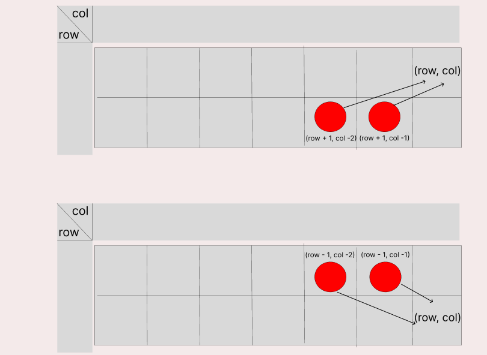

## 문제해결
2가지 방법으로 풀어보려고 한다. 
1. top-down 방식 [Main.java]
이렇게 불러야 할지 모르겠지만 top-down 방식으로 풀어보도록 하겠다.     
먼저 어떠한 값 (row, col)에 마지막에 도달하기 위해서는 아래 그림과 같은 접근만 가능하다.
   
그림에서 같이 값(row, col)에 대하여 접근할 수 있는 방법은 row = 0 일 때는 (row + 1, col - 2)와 (row + 1, col -1)에서 접근이 가능하다.  
다음으로 row = 1일때는 (row - 1, col -2), (row - 1, col - 1)에서 접근이 가능하다.   
문제에서는 최대값을 구하는 것이기에 접근할 수 있는 두 값 중 큰 것에서 마지막 값 (row, col)에 접근하면 되는 것이다. Math.max((row + 1, col - 2), (row + 1, col - 1)) [규칙 부분]  
top-down 방식은 재귀를 통해 마지막까지 접근해 다시 역으로 올라오는 것이다. 다시말해 재귀의 종료시점은 배열이라면 첫 번째 값 [0]에 해당할 것이다. [초기화 부분]  
다음으로 중요한 것은 예외이다. 위에서 보인 규칙에 따르면 현재 값의 (col -1)과 (col - 2) 값을 비교한다. 해당 문제를 풀기위해 배열을 사용할텐데, col <=1 이라면 배열에 벗어나 버려 오류가 발생한다 [예외 부분]   
위의 조건들을 합치면 문제를 해결할 수 있다.

- 케이스 T를 입력받는다. 이 후에 입력받는 배열값을 나누기 위해 StringTokenizer를 선언한다.
    - static 영역에는 메모이제이션에 사용할 배열과, 입력받는 스티커 정보를 저장할 배열을 선언한다.
```java
static int[][] stickers;
static Integer[][] dp;

BufferedReader br = new BufferedReader(new InputStreamReader(System.in));
StringTokenizer st;

int T = Integer.parseInt(br.readLine());
```
- 테스트 케이스만큼 돌면서 for문 안에서는 배열의 가로 길이 N을 입력받는다. 
  - 입력받은 N 으로 크기 [2][N + 1] 배열을 dp, stickers 배열을 초기화한다.  
    - 여기서 N + 1인 이유는 인덱스는 0 부터 시작하기 때문에 쉽게 이해하기 위해 1크기를 더 더했다.
  - 입력받은 스티커 정보에서 첫 번째 값 [0][1] 과 [1][1]의 값을 가지고 dp 배열의 초기값을 넣어준다.
```java
for(int i = 0; i < T; i++) {
    int N = Integer.parseInt(br.readLine());

    stickers = new int[2][N + 1];

    for(int j = 0; j < 2; j++) {
        st = new StringTokenizer(br.readLine(), " ");
        for(int k = 1; k <= N; k++) {
            stickers[j][k] = Integer.parseInt(st.nextToken());
        }
    }

    dp = new Integer[2][N + 1];

    dp[0][1] = stickers[0][1];
    dp[1][1] = stickers[1][1];

    System.out.println(Math.max(recur(0, N), recur(1, N)));
}
```
- 다음으로 재귀로 호출할 메서드이다.
  - 메서드의 인자로는 2개의 정보를 받는다. 
    - 하나는 row, 다른 하나는 col이다.
  - 재귀의 종료 조건으로 col == 1 일때 stickers[row][col]을 리턴한다.
    - col == 1 인 이유는 col가 1에 도달했다는 건 오른쪽에서 시작하여 왼쪽 끝에 도달하였다는 말이기 때문이다.
  - 다음으로는 메모이제이션 배열 dp가 초기화되지 않았다면 [dp[row][col] == null] 초기화를 해준다.
  - (여기서 dp 배열의 값은 큰 값으로 갈 수록 이전 값의 누적 합이 저장된다.)
    - 이 때 조건으로는 col == 2 일 때는 뒤로 한칸밖에 없기 때문에 따로 최대값을 비교하지않고 (col -1) 값만 호출하여 현재 stickers[row][col] 값에 더해서 초기화 해준다.
      - 쉽게 생각하여 현재 (row, col) 값에 도달하기 위해서는 (row - 1, col -1), (row -1, col - 2) 둘 중에서 와야하는데, col == 2 인 상태에서 (col -2)를 배열을 넘어가기 때문이다.   
    - col > 2 라면 그림에서 봤듯이 col -2, col - 1 중에 큰 값을 찾은 후 현재 값 stickers[row][col]과 더하여 dp[row][col]를 초기화해준다.
      - 여기서 1 - row 인 이유는 row 값은 0 또는 1 인데, 만약 현재 값이 0이라면 1에서 도달한 것이기에 1 - 0 => 1 이 되고, 현재 값이 1이라면 0 에서 도달한 것이기에 1 - 1 => 0 이 된다.
        - 즉, 쉽게 표현하기 위하여 1 - row로 짧게 쓴 것이다.
  - 마지막에는 모두 초기화 된 메모이제이션에서 값만 꺼내어 return 한다.
- 메서드를 호출했던 부분에서는 마지막 값 dp[0][N] 과 dp[1][N] 중에서 큰 값을 출력한다.
```java
private static int recur(int row, int col) {

    if (col == 1) {
        return stickers[row][col];
    }

    if (dp[row][col] == null) {
        if (col == 2) {
            dp[row][col] = recur(1 - row, col - 1) + stickers[row][col];
        } else {
            dp[row][col] = Math.max(recur(1 - row, col - 1), recur(1 - row, col - 2)) + stickers[row][col];
        }
    }

    return dp[row][col];
}
```

2. bottom-up 방식
위와는 다르게 for문을 통해 모든 값을 설정하고 마지막에 Math.max를 통해 dp[0][N], dp[1][N] 중 큰 값을 출력하는 것은 동일하다.  
규칙은 위에서 설명했기에 생략한다.  

- T를 입력받는다.
- 여기서는 dp 배열을 Integer가 아닌 int 배열로 선언한다.
```java
static int dp[][], stickers[][];

BufferedReader br = new BufferedReader(new InputStreamReader(System.in));
StringTokenizer st;

int T = Integer.parseInt(br.readLine());
```
- test case t 만큼 for문을 돈다.
  - 여기서도 동일하게 n을 입력받고, 그 크기만큼 stickers, dp 배열을 초기화한다.
  - 다음으로 스티커 배열을 입력받아 초기화 시켜준다.
  - 초기값 dp[0][1], dp[1][1] 도 stickers 배열에서 가져와 초기화한다.
  - 여기서는 재귀를 사용하지않고, col == 2 부터 시작해 dp 배열의 값을 초기화한다.  
    - 여기서도 col == 2 일때 위에처럼 범위를 벗어나는게 아닌가 라고 생각할 수 있는데, 그래서 dp배열을 Integer가 아닌, int로 한 이유도 있다.
      - 원래라면 [0][0], [0][1] 에 값을  0으로 초기화 시켜줬어야 했지만, int 배열 초기값이 0 이기 때문에 따로 초기화 하지 않은 것이다.
  - 동일한 규칙을 이용해 (col - 2), (col - 1) 중 큰 값과 현재 값(stickers[0][j] or stickers[1][j])을 더하여 dp값을 초기화한다.
  - 마지막도 동일하게 dp[0][N], dp[1][N] 중 큰 값을 출력한다.
    
```java
for(int i = 0; i < T; i++) {
    int N = Integer.parseInt(br.readLine());

    stickers = new int[2][N + 1];
    dp = new int[2][N + 1];


    for(int j = 0; j < 2; j++) {
        st = new StringTokenizer(br.readLine(), " ");
        for(int k = 1; k <= N; k++) {
            stickers[j][k] = Integer.parseInt(st.nextToken());
        }
    }

    dp[0][1] = stickers[0][1];
    dp[1][1] = stickers[1][1];

    for(int j = 2; j <= N; j++) {
        dp[0][j] = Math.max(dp[1][j - 1], dp[1][j - 2]) + stickers[0][j];
        dp[1][j] = Math.max(dp[0][j - 1], dp[0][j - 2]) + stickers[1][j];
    }

    System.out.println(Math.max(dp[0][N], dp[1][N]));
}
```
