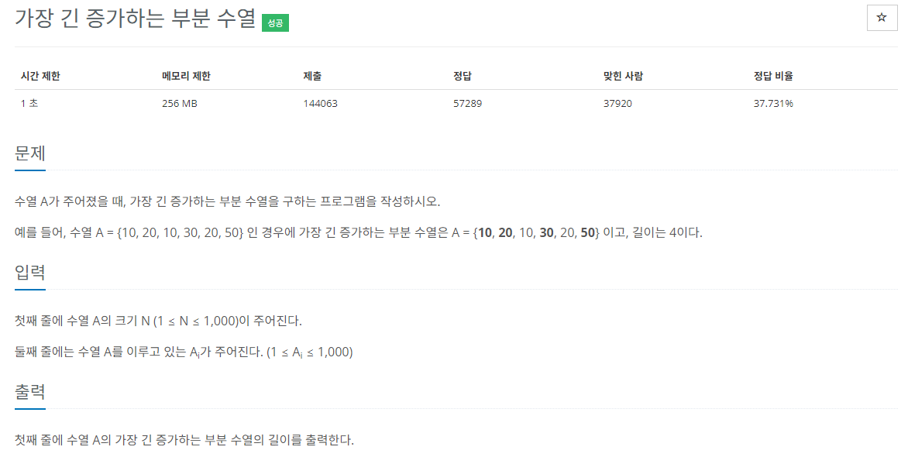
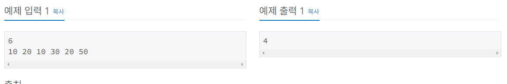

## 문제 해결
이 문제는 다른 말로는 LIS(최장 증가 부분 수열)라고 부른다고 한다.  
주어진 수열에서 오름차순으로 구성 가능한 원소들을 선택하여 최대 길이를 찾아 내는 것.   
아래에서 풀 문제는 시간 복잡도가 O(N^2) 이다.   


먼저 예제 출력을 갖고 살펴보면   
기본적으로 수열을 갖고 있지 않아도 1이 할당된다.[자기 자신]    
idx[0] = 10; 일때는 수열이 없기 때문에 값이 1이된다.
idx[1] = 20; 일때는 앞에 값 {10, 20}으로 수열의 값이 2가 된다.     
idx[2] = 10; 일 때는 앞에 값은 10보다 큰 20이기 때문에 수열의 값이 1이된다.    
idx[3] = 30; 일 때는 idx[0]의 값 10, idx[1]의 값 20, 그리고 자신까지 해서 총 3이된다.  {10, 20, 30}  
idx[4] = 20; 일 때는 idx[0]의 값 그리고 자기자신 까지 해서 총 2의 값을 가진다. {10, 20}  
idx[5] = 50; 일 때는 idx[0], idx[1], idx[3]과 자기 자신까지 해서 총 4가 된다. {10, 20, 30, 50}    
그렇다면 어떻게 풀면 될까?   
각 값에 대하여 이전 값과 비교하여 작다면 수열의 값을 늘려주면 된다.   
즉, for loop에서 i가 3일 때 3 아래 값 0,1,2 와 비교하여 값이 수열에 해당한다면 값을 증가시켜주면 된다.   


### top-down
dp[] 은 기본적으로 idx의 해당하는 수열의 갯수를 저장하고 있다.   
dp[]에서 기본적으로 모든 값은 1[자기자신]값을 갖고있다.   
N의 값에 대하여 for loop를 도는데, 초기값은 N, i를 감소시키면서 N-1,N-2 ... 0 까지    
N값과 비교하며 N보다 작다면 dp[N] 에 dp[N]과 재귀함수(i) + 1과 비교하여 큰 값을 dp[N]에 저장한다.   
여기서 +1을 해주는 이유는 예를들어서,   
N의 값이 비교하는 값보다 큰데, 비교하는 값 dp[i]에 대하여 dp[i]의 값은 dp[N]에 합쳐지는것 뿐만 아니라 arr[i]의 값은  
arr[N]에 속해지는 수열이기에 + 1을 해주는 것이다.   


- N을 입력받는다.  
  - N을 입력받고 dp 배열과 number 배열을 초기화 해준다.  
    - 여기서 dp배열은 수열의 값을 저장한다.
```java
static Integer dp[];
static int[] number;

BufferedReader br = new BufferedReader(new InputStreamReader(System.in));
int N = Integer.parseInt(br.readLine());

dp = new Integer[N];
number = new int[N];
```
- 다음으로 입력받는 수열을 number 배열에 저장한다.
```java
for(int i = 0; i < N; i++) {
    number[i] = Integer.parseInt(st.nextToken());
}
```
- 초기값을 설정한다
```java
dp[0] = 1;
```
- for loop를 돌면서 dp[] 값을 초기화한다.
```java
for(int i = 0; i < N; i++) {
    recur(i);
}
```
- 재귀함수에서는 dp[N]이 초기화 되지 않았을 경우 dp값을 초기화 해준다.
  - 여기서는 dp[N]의 값의 초기값은 1로 설정해준다.
  - for loop를 돌면서 N - 1 부터 시작하여 0까지 number 값을 비교한다.
  - dp[N] 에는 dp[N] 값과 재귀함수(i) + 1 과 비교하여 큰 값을 dp[N]에 저장한다.   

```java
private static int recur(int N) {

    if(dp[N] == null) {

        dp[N] = 1;

        for(int i = N - 1; i >= 0; i--) {

            if(number[N] > number[i]) {
                dp[N] = Math.max(dp[N], recur(i) + 1);
            }
        }
    }

    return dp[N];
}
```
- dp[] loop를 돌면서 max값을 출력한다.
```java
int max = Integer.MIN_VALUE;

for(int i = 0; i < N; i++) {
    if (max < dp[i]) {
        max = dp[i];
    }
}

System.out.println(max);
```


### bottom-up
top-down과 동일한데 값을 설정할 때 for loop를 통해 dp[]을 초기화한다.
top-down과는 다른건 dp값을 초기화 할 때 조건이 하나 더 붙는다.   
조건이라기보다 top-down에서 Math.max로 비교하는 값이 조건으로 추가되는 것이다.   
기본적으로 number[i] 값이 비교하려는 number[j] 보다 커야한다. 그래야만 수열이 성립하기 때문이다.   
다음으로는 Math.max에서 dp[i] 값과 recur(N) + 1 값을 비교하는것을 여기에서는    
number[i] 에 해당하는 dp[i] 와 number[j]에 해당하는 dp[j] 에서 만약 number[i]가 더 큼에도 불구하고    
dp[i]가 dp[j] 보다 작을 경우 dp[i]에 dp[j] + 1을 초기화한다.   
여기서 + 1을 하는 이유는 number[i]가 number[j]보다 크기 때문에 number[j]가 number[i]의 수열에 포함되고, 자기자신 number[j] 도    
number[i]의 수열에 포함되기 때문에 + 1을 해주는 것이다.   


- N을 입력받는다.
```java
static Integer dp[];
static int[] number;

BufferedReader br = new BufferedReader(new InputStreamReader(System.in));

int N = Integer.parseInt(br.readLine());

dp = new Integer[N];
number = new int[N];
```
- 수열을 입력받아 number[] 을 초기화한다.
```java
StringTokenizer st = new StringTokenizer(br.readLine(), " ");

for(int i = 0; i < N; i++) {
    number[i] = Integer.parseInt(st.nextToken());
}
```
- dp 초기값을 설정해준다.
```java
dp[0] = 1;
```
- 초기값 다음 1 부터 시작하여 N-1 까지 순회하며 dp값을 초기화한다.
    - top-down과 동일하게 초기값은 dp[i]의 값은 1로 초기화해준다.
    - 2중 for loop에서는 0부터 시작하여 i전 까지 돌면서 number[i]와 비교해준다.
    - 여기서는 조건이 number[i]가 number[j] 보다 큰데도, dp[]의 값이 dp[j] 보다 작을경우
    - dp[i]에 dp[j] + 1로 초기화 해준다.
```java
for(int i = 1; i < N; i++) {

    dp[i] = 1;

    for(int j = 0; j < i; j++) {

        if(number[i] > number[j] && dp[i] <= dp[j]) {
            dp[i] = dp[j] + 1;
        }
    }
}
```
- dp를 순회하며 max값을 출력한다.
```java
int max = Integer.MIN_VALUE;

for(int i = 0; i < N; i++) {
    if(max < dp[i]) {
        max = dp[i];
    }
}

System.out.println(max);
```

