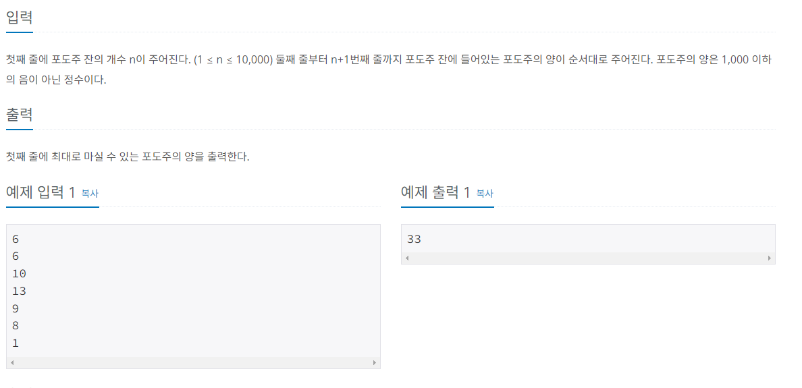

## 문제 풀이
해당 문제에서는 N에 대하여 N을 반드시 먹어야 한다는 조건이 없다.    
따라서 비교 조건을 하나 더 추가해 주어야한다. (이 후에 설명)   
몇 가지 선택이 있다.   
- N에 있는 포도주를 마시지 않을 경우
이 때는 dp[N - 1] 값을 사용하면 된다.   

여기서 dp배열은 최대로 마실 수 있는 포도주의 값을 저장한 배열이다.   
예를 들어,      
6 5 4 3 2 1 순서대로 포도주가 있을 경우   
dp[1] = 6;   
dp[2] = 11;
dp[3] = 11;   
과 같이 이 전에 최대로 마실 수 있는 포도주의 값을 저장한 배열이다.   
여기서 dp[3]에 11이 들어간 것에 의문을 가질 수 있는데, 위의 조건에서 최대로 2개 까지 연속으로 마실 수 있다는   
조건이 있다. 따라서 dp[3]의 값은 wines[1], wines[2], wines[3] 을 가지고 만들 수 있는 값 중 11이 가장 크기 때문에   
dp[3]에 11이 들어가게 된다.    

이어서,   
- N에 있는 포도주를 마실 경우
이 때는 2가지 경우로 나뉜다.   
- N에 있는 포도주를 마시면서 N - 1에 있는 포도주를 마시는 경우
- N에 있는 포도주를 마시면서 N - 1 에 있는 포도주를 마시지 않고 N - 2의 포도주를 마시는 경우 

첫 번째의 경우 [N - 1를 마시는 경우]   
wines[N - 1]를 마실 경우를 생각해보면 이 전 dp[N - 3] (N - 3 까지의 최대로 마실 수 있는 포도주의 값을 합한 값)   
에 wines[N -1] 값을 더한것이 최대가 될 것이다.   
예를 들어,   
... N -3, N - 2, N - 1, N 
...  ㅇ ,   ㅇ  ,  ㅇ  , ㅇ  
와 같이 있을경우 dp[N - 1]을 마실 경우 N -2의 값은 마실수 없게 된다.    
따라서 dp[N - 3]에 저장되어 있는 누적 값에 wines[N -1], wines[N]을 합한 값이 될 것이다.   
- 여기서 N -2, N -1 중에 더 큰 값을 마시면 안되는지에 대한 의문이 들 수 있는데,   
N - 1, N - 2중에 비교하여 마실 수 없는 이유는    
두 값을 비교하여 만약 N -2 가 더 큰경우 dp[N -3] + wines[N -2]가 되는데,   
dp[N - 3]에 대하여 이 전에 N - 4를 마셨다면 [N -4], [N - 3], [N -2]가 될 수 있기 때문에 비교를 할 수 없다.   
위의 의견은 확실하지 않다...     


두 번째의 경우 [N - 2를 마시는 경우]
이 때는 N - 2 를 마셨기 때문에 N - 1를 마실 수 없다. [이어서 N 까지 마시면 2잔을 넘어버리기 때문에]   


### 조건을 코드로
위의 조건을 가지고 코드로 만들면 아래와 같다.

- N을 마시지 않을 경우
  - dp[N - 1]
- N을 마실 경우
  - dp[N - 3] + wines[N - 1] + wines[N]
  - dp[N - 2] + wines[N]

    

코드로 보면 아래와 같다.

- N을 입력받는다.
- 입력받은 N으로 두개의 배열을 초기화 한다.
    - 하나는 입력받을 와인을 저장할 배열 wines[]
    - 하나는 와인의 값을 누적하여 저장할 배열 dp[]
- N + 1인 이유는 인덱스는 0부터 시작하기 때문에
```java
static Integer dp [];
static int wines[];

BufferedReader br = new BufferedReader(new InputStreamReader(System.in));
int N = Integer.parseInt(br.readLine());
dp = new Integer[N + 1];
wines = new int[N + 1];
```
- 입력받는 포도주 값을 저장할 배열을 초기화한다.
```java
for(int i = 1; i <= N; i++) {
    wines[i] = Integer.parseInt(br.readLine());
}
```
- 초기값을 설정한다.
  - 초기값은 dp[0],dp[1]
  - 조건에 따라 N이 2보다 크거나 같을경우 dp[2]의 값도 초기값을 설정해준다.
    - 위의 조건을 보면 N -3 까지 사용하기 때문에
    - N >= 2 일 때만 초기화 하는 이유는 N이 1일경우 n - 3 에 접근하면 오류가 발생하기 때문에

```java
dp[0] = 0;
dp[1] = wines[1];

if(N >= 2) {
    dp[2] = wines[1] + wines[2];
}

System.out.println(recur(N));
```
- dp를 초기화할 재귀함수를 호출한다.
- dp의 값이 null일 경우 dp의 값을 초기화 한다.[메모이제이션]
  - 이 때는 어떻게 비교를 하던 값다.
  - 하지만 이왕 묶을 수 있는 것들을 묶자면 N을 선택하는 조건들 끼리 묶어 먼저 비교 후 
  - N을 선택하지 않는 것을 비교한다.
```java
private static int recur(int N) {

if(dp[N] == null) {
//            dp[N] = Math.max(Math.max(recur(N - 2) + wines[N], recur(N - 3) + wines[N -1] + wines[N]), recur(N - 1));
//            dp[N] = Math.max(Math.max(recur(N - 1), recur(N - 2) + wines[N]), recur(N - 3) + wines[N - 1] + wines[N]);
    dp[N] = Math.max(Math.max(recur(N -2), recur(N - 3) + wines[N - 1]) + wines[N], recur(N - 1));
}


return dp[N];
}
```