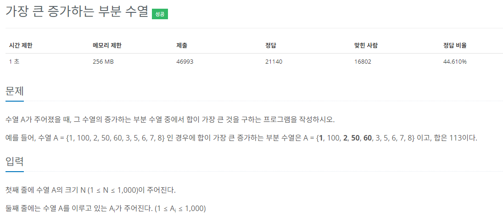
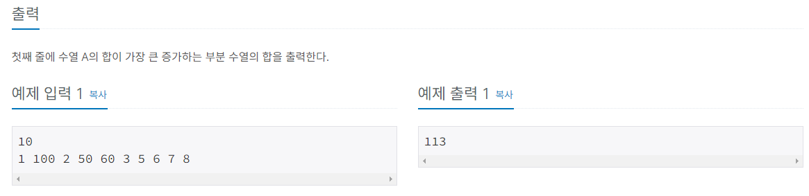

## 문제풀이

이 문제에서는 dp의 값으로는 해당 배열의 부분 수열의 합이 들어간다.   
비교하려는 arr[N] 에 대하여 N - 1부터 arr[N]과 비교하여 값이 더 작을경우   
dp[N] 에 dp[N] 과 dp[N - 1] + arr[N] 를 비교하여 더 큰 값을 dp[N] 에 할당한다.   

### top-down
- N을 입력받아 배열을 초기화 한다.
  - top-down과 bottom-up을 같은 class 내에 작성하기 위해 N을 static 변수로 작성


```java
static int[] number;
static Integer[] dp;
static int N;

 BufferedReader br = new BufferedReader(new InputStreamReader(System.in));

N = Integer.parseInt(br.readLine());
number = new int[N];
dp = new Integer[N];
```
- 다음으로 수열을 입력받아 number 배열을 초기화한다.
```java
StringTokenizer st = new StringTokenizer(br.readLine(), " ");
for(int i = 0; i < N; i++) {
    number[i] = Integer.parseInt(st.nextToken());
}
```
- dp 배열을 초기값을 설정한다. 
  - 초기값은number[0] 의 값과 같다.
  - 초기값을 설정하지 않아도 된다.
```java
dp[0] = number[0];
```

- 다음으로 dp[]의 값을 초기화 하기 위해 재귀함수를 호출한다.
  - 재귀함수 내부에서는 dp[N] 값이 초기화가 되어있지 않다면 값을 구해 할당한다.
  - 먼저 dp[N]에 초기값 number[N]을 할당한다. 수열의 합을 누적하기 전 자기자신은 반드시 들어가기 때문에
  - 이 때 인자로 받은 N에 대하여 N - 1 부터 0 까지 for loop를 돌면서   
  - number[N]이 number[i] 보다 클 때 dp[N] 과 dp[i] + number[N] 에 대하여 더 큰 값을   
    - dp[i]는 재귀를 통해 구한다.
  - dp[N]에 할당한다.  
```java
private static int recur_lis(int N) {

    if(dp[N] == null) {
        dp[N] = number[N];

        for(int i = N - 1; i >= 0; i--) {

            if(number[N] > number[i]) {
                dp[N] = Math.max(dp[N], number[N] + recur_lis(i));;
            }
        }
    }

    return dp[N];
}
```
- 마지막으로 배열 중 가장 큰 값을 찾아 출력해준다.
```java
int max = Integer.MIN_VALUE;

for(int i = 0; i < N; i++) {

    if(max < dp[i]) {
        max = dp[i];
    }
}

System.out.println(max);
```

### bottom-up
- top-down과 동일하게 입력받아 배열을 초기화 하는 부분은 같다.


- N을 입력받는다.
  - 입력받은 N으로 배열을 초기화한다.
```java
static int[] number;
static Integer[] dp;
static int N;

BufferedReader br = new BufferedReader(new InputStreamReader(System.in));

N = Integer.parseInt(br.readLine());
number = new int[N];
dp = new Integer[N];
```
- 다음으로 입력받는 값을 이용해 number를 초기화해준다.
```java
StringTokenizer st = new StringTokenizer(br.readLine(), " ");

for(int i = 0; i < N; i++) {
    number[i] = Integer.parseInt(st.nextToken());
}
```
- dp[0]의 초기값을 설정한다
  - 설정을 안해도 되는데 이 후 bottom-up for-loop에서 0부터 시작하면 된다.
```java
dp[0] = number[0];
```

- bottom-up에서는 for loop를 돌면서 먼저 dp[i]에 number[i]값을 초기화한다.
  - dp[i]에 number[i]를 초기화하는 이유는 수열에 있어서 자기자신은 반드시 들어가기 때문이다.
- 다음으로 2중 for-loop에서는 0 부터 i보다 작을 때 까지 순회하며 number[i]가 number[j]보다 클 경우
- dp[i] 에 dp[i]와 dp[j] + number[i]를 비교화여 더 큰 값을 할당한다.
  - 여기서 의문이 들 수 있는데 단순 dp[i] += number[j]를 하면 되지 않는가?  라고 생각할 수 있는데  
  - [1, 3, 2, 4]의 예로 들자면
  - N = 4에 대하여 dp+= number[j]를 할경우 답은 1 + 3 + 2 + 4 = 10이 될텐데, 하지만 수열이란 조건이 빠져있다.  
  - 수열을 적용하게 된다면 1,3,4 = 8 이 될것이다. 
  - 다르게 생각해보면 
  - dp[0] = 1; {1}
  - dp[1] = 4; {1, 3}
  - dp[2] = 3; {1, 2}
  - dp[4] = 8; {1 ,3 , 4}
  - 와 같은 값을 가지게 될 것이니 따라서
  - Math.max(dp[j] + number[i], dp[i])로 비교하여 값을 dp[i]에 할당해야 하는 것이다.
```java
private static void bottom_up_lis() {

    for(int i = 1; i < N; i++) {
        dp[i] = number[i];

        for(int j = 0; j < i; j++) {
            if(number[i] > number[j]) {
                dp[i] = Math.max(dp[j] + number[i], dp[i]);
            }
        }
    }
}
```
- dp 배열을 순회하며 가장 큰 값을 출력한다.
```java
int max = Integer.MIN_VALUE;

for(int i = 0; i < N; i++) {

    if(max < dp[i]) {
        max = dp[i];
    }
}

System.out.println(max);
```