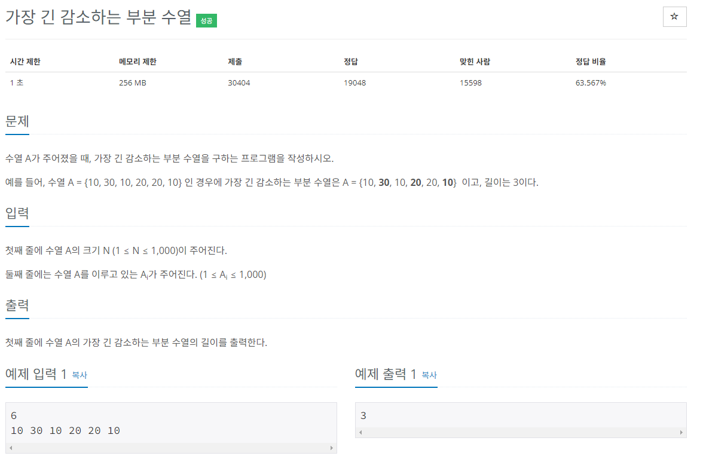

## 문제해결
LIS와 반대로 LDS 의 문제이다. 이 문제 또한 DP로 풀 수 있다.   
LIS와는 반대로 감소하는 수열이기 떄문에 N에 대한 값을 비교할 때는 비교하는 N의 값이 이 전 값보다 작을 때 
조건을 만족하게 된다.   
LIS를 풀었었다면 쉽게 LDS문제도 풀 수 있다.   
코드로 보자면 아래와 같다.  

### top-down
- N을 입력받고 입력받은 N으로 배열을 초기화한다.
  - dp 배열은 수열의 길이를 저장하는 배열이고
  - number 배열은 다음으로 입력받는 수열의 정보를 저장한다.
    - N + 1로 초기화한 이유는 (1 <= N <= 1000)에 이해를 돕기위해 
    - 인덱스0이 아닌 시작을 1로 잡았기 때문에
```java
static Integer[] dp;
static int[] number;

BufferedReader br = new BufferedReader(new InputStreamReader(System.in));

int N = Integer.parseInt(br.readLine());

dp = new Integer[N + 1];
number = new int[N + 1];
```
- 다음으로 입력받은 수열을 number 배열에 저장한다.
```java
StringTokenizer st = new StringTokenizer(br.readLine(), " ");

for(int i = 1; i <= N;i ++) {
    number[i] = Integer.parseInt(st.nextToken());
}
```
- 재귀함수를 호출하여 dp배열을 초기화 한다.

```java
for(int i = N; i >= 0; i--) {
   recur_lds(i);
}
```
- 재귀함수에서는 dp[N]의 값이 아직 초기화 되지 않았다면 먼저 dp[N]의 값을 1로 초기화한다. 
  - 1로 초기화하는 이유는 수열의 길이를 저장하는 dp배열에 기본적으로 자기자신이 포함되기 때문에 1로 초기화한다.
- 다음으로는 위에서 아래로 for-loop를 돌면서 값을 비교한다.
  - 이 떄 입력받은 number[N]의 값이 비교하려는 for-loop의 number[i]의 값보다 작다면 
  - dp[N]에 dp[N]과 dp[i] + 1의 값을 비교하여더 큰값을 저장한다.
    - dp[i] + 1의 값은 다른말로 recur_lds(i) + 1 과 같다.
      - 그 이유는 dp[i]에 대하여 for-loop는 위에서 아래로 진행 중인데 아직 dp[i]에 해당하는 값은   
      - 초기화 되지 않았기 때문에 재귀를 통해 초기화를 해준다.
```java
static int recur_lds(int N) {

    if(dp[N] == null) {

        dp[N] = 1;
        for(int i = N - 1; i >= 0; i--) {

            if(number[N] < number[i]) {
                dp[N] = Math.max(dp[N], recur_lds(i) + 1);
            }
        }
    }


    return dp[N];
}
```
- dp 배열을 순회하며 큰 값을 출력한다.
```java
int max = Integer.MIN_VALUE;

for(int i = 1; i <= N; i++) {
    max = Math.max(dp[i], max);
}

System.out.println(max);
```


### bottom-up
- Bottom-up도 top-down과 비슷하지만 다른게 있다면 아래에서 부터 순회를 시작하여 dp 배열을 채우고 
- 2중 for-loop를 사용한다는 점이다.
- 헷갈릴수도 있는데 비교의 기준이 되는 number[N]의 값이 비교하려는 number[j]의 값 보다 작을 때 조건이 성립한다.   

- N을 입력받아 배열을 초기화한다.
```java
BufferedReader br = new BufferedReader(new InputStreamReader(System.in));

int N = Integer.parseInt(br.readLine());

dp = new Integer[N + 1];
number = new int[N + 1];

```
- 다음으로 입력받는 값으로 number 배열을 초기화한다.
```java
StringTokenizer st = new StringTokenizer(br.readLine(), " ");

for(int i = 1; i <= N;i ++) {
    number[i] = Integer.parseInt(st.nextToken());
}
```
- dp 배열의 값을 초기화한다.
- 이때는 아래서 부터 위로 값을 채워나간다.
  - 2중 for-loop를 사용하는데, 기본적으로 자기자신이 수열에 포함되기 때문에 
  - dp[i]의 값을 1로 초기화한다.
  - 2번째 for-loop에서는 i보다 작을 때 까지 loop를 돌면서
    - i보다 작은 이유는 예를들어 i= 3 일때 1,2; 즉, 이 전값과 비교하여
    - 더 큰 값이 있을경우 조건에 있는 로직을 실행하여 dp[i]를 초기화한다.
  - 비교하려는 number[j]보다 작다면 dp[i]의 값과 dp[j] + 1값을 비교하여 더 큰 값을 저장한다.
    -  +1인 이유는 dp[j]에 대한 값이 i에 속해지기 때문에 i값을 카운팅하기 위해 +1을 해주는 것이다.
```java
static void bottom_up(int N) {
    for(int i = 1; i <= N; i++) {
        dp[i] = 1;

        for(int j = 0; j < i; j++) {

            if(number[i] < number[j]) {
                dp[i] = Math.max(dp[i], dp[j] + 1);
            }
        }
    }
}
```
- dp배열을 순회하며 큰 값을 출력한다.
```java
int max = Integer.MIN_VALUE;

for(int i = 1; i <= N; i++) {
    max = Math.max(dp[i], max);
}

System.out.println(max);
```

