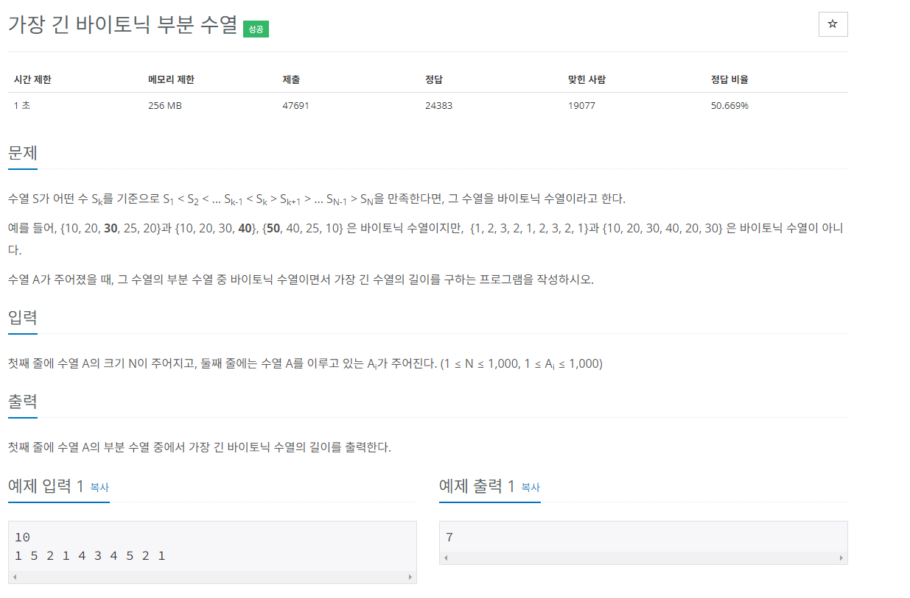
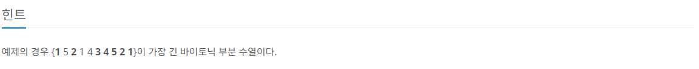

## 문제해결
이 문제는 어떤한 값 기분으로 왼쪽은 증가하는 수열 [LIS] 오른쪽으로는 감소하는 수열[LDS]이란걸 알 수 있다.   
그렇다면 이 문제 같은경우는 어떻게 풀면될까.. 하고 생각해보면  
어떠한 수열의 값 N을 기준으로 왼쪽으로는 LIS를 오른쪽으로는 LDS를 진행해준 후 두 개의 배열의 값을 합친 값 중   
가장 큰 값을 출력하면 되지 않을까란 생각이 들 수 있다.   
말 그대로 N을 기준으로 N - 1 부터 시작하는 LIS를 통해 LIS_DP를 초기화하고,    
N + 1 부터 시작하는 LDS를 통해 LDS_DP를 초기화하여 두 개의 배열의 합을 구하면 된다.   
여기서 조심해야 하는 것은 LIS,LDS 2번을 하게 되면 자기자신 N이 2번 들어가기 때문에 **두 개의 합한 값에 -1**을 반드시 해주어야한다.   

### top-down
N을 입력받아 2개의 dp 배열을 초기화 해준 후   
하나의 for문에서는 N - 1부터 0까지 순회하는 LIS 를, 다른 하나는 N + 1부터  length 전 까지 순회하는 LDS를 진해하면 된다.   
여기서 주의해야할 점은 다른 LDS를 풀 때는 top-down방식에서 위에서 아래 즉, N - 1 부터 0 까지 순회하였지만, **여기서는 N + 1부터 dp.length 전 까지
순회한다는 점을 명심하자.** 

- N을 입력받아 numbers 배열과 LIS_DP, LDS_DP 배열을 초기화 해준다.
```java
static int[] numbers;
static Integer[] lis_dp;
static Integer[] lds_dp;

BufferedReader br = new BufferedReader(new InputStreamReader(System.in));

int N = Integer.parseInt(br.readLine());

numbers = new int[N];

lis_dp = new Integer[N];
lds_dp = new Integer[N];
```
- 다음으로 입력받는 수열을 가지고 numbers 배열을 초기화 해준다.
```java
StringTokenizer st = new StringTokenizer(br.readLine(), " ");

for(int i = 0; i < N; i++) {
    numbers[i] = Integer.parseInt(st.nextToken());
}
```
- 먼저 LIS[가장 긴 증가 수열]을 실행하여 LIS_DP를 초기화한다.
  - for 초기화, 조건에서 볼 수 있듯이 시작은 0부터 N전 까지 이다.
  - 재귀함수 내에서는 dp가 초기화되지 않았다면 먼저 수열은 자기자신을 포함하기 때문에 1로 초기화한다.
  - N - 1 부터 0까지 즉, N의 왼쪽으로 진행하며 LIS를 찾아 dp를 초기화한다.
  - 가장 긴 증가 수열이기 때문에 number[N]의 값이 number[i] 보다 클 때 로직을 실행한다.
  - 로직으로는 lis_dp[N]의 값을 dp[N]과 recur_lis(i) + 1 보다 큰 값을 초기화한다.   
  - 즉, dp[N]과 if 조건에 맞는 dp[i] + 1 값 중 큰 값을 dp[N]에 초기화한다.  
```java
for(int i = 0; i < N; i++) {
    recur_lis(i);
}

static int recur_lis(int N) {

    if(lis_dp[N] == null) {
        lis_dp[N] = 1;

        for(int i = N - 1; i >= 0; i--) {
            if (numbers[N] > numbers[i]) {
                lis_dp[N] = Math.max(lis_dp[N], recur_lis(i) + 1);
            }
        }
    }


    return lis_dp[N];
}
```
- 다음으로는 LDS를 실행한다.
- for 초기값에서 볼 수 있듯이 N - 1 부터 0 까지 즉, LIS와는 반대로 순회한다.
- 재귀 메서드내에서는 LIS과 동일하게 값이 없다면 기본적으로 1로 초기화한다.
- LDS와는 다르게 N을 기준으로 오른쪽으로 진행하며 [i = N + 1]
- 감소하는 부분이기 때문에 조건은  number[N]이 number[i]보다 클 때가 조건이 된다.   
  - 예를 들어 [5, 4, 3, 2, 1]과 같이 있다면 
  - N이 = 0일때 N = 1 [4]부터 시작하여 length -1 까지 진행하며   
  - number[N] = 5; 보다 작다면 감소수열이기 때문에 조건이
  - number[N] > number[i] 와 같이 나오는 것이다.  
- 여기서는  dp[N]과 dp[N + 1] + 1 중에 더 큰 값을 저장한다.
```java
for(int i = N - 1; i >= 0; i--) {
    recur_lds(i);
}

static int recur_lds(int N) {

    if(lds_dp[N] == null) {
        lds_dp[N] = 1;
    
        for(int i = N + 1; i < lds_dp.length; i++) {
            if(numbers[N] > numbers[i])  {
                lds_dp[N] = Math.max(lds_dp[N], recur_lds(i) + 1);
            }
        }
    }

    return lds_dp[N];
}

```
- 마지막으로 두 배열의 합 중 가장 큰 값을 출력한다.
- 여기서 잊지 말아야 할 것은 N의 값이 LIS, LDS 2번 들어가기 때문에 [-1] 을 해 주어야 한다.
```java
int max = Integer.MIN_VALUE;

for(int i = 0; i < N; i++) {

    max = Math.max(max, recur_lds(i) + recur_lis(i) - 1);
}

System.out.println(max);
```
