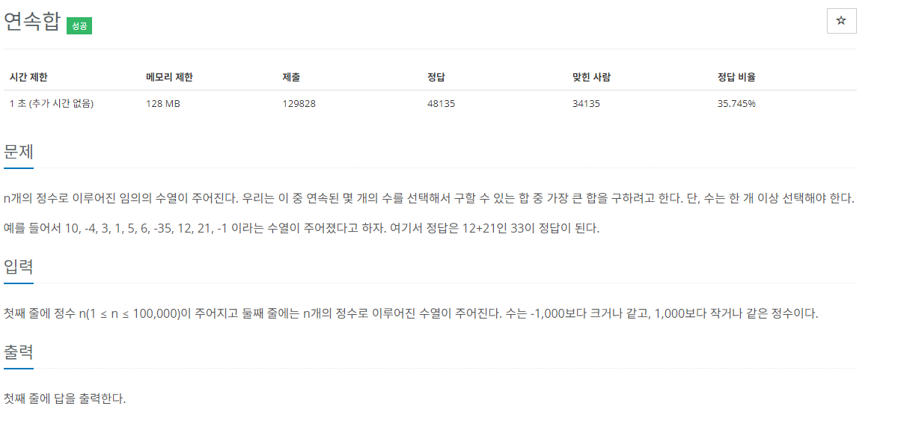
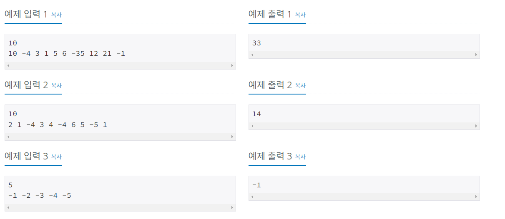

## 문제해결
이 문제는 손으로 써보면 쉽게 해결할 수 있는 문제이다.   
이 문제의 핵심은 연속된 몇 개의 수를 합하여 가장 큰 합을 구하는 것이다.   
맨 처음 이 문제를 풀 떄 수열로 헷갈려서 문제를 틀렸는데, 잘 읽어보면 연속된 몇 개의 수에 답이 있다.  
0부터 N까지 수를 합하면서 현재 [자기자신] 과 [이 전까지 합한 수 + 자기자신]을 비교하여 큰 값을 dp에 저장하면 된다.   
예를들어서 예제 입력   
10 -4 3 1 5 6 -35 12 21 -1   
- idx[0] = 10;
  - idx[0] 이전 값을 비교할 것이 없기 때문에 자기자신 10이 가장 크다.
  - dp[0] = 10;
- idx[1] = -4; [이전 값 = 10]+ [자기자신 = -4] = [6];
  - idx[1]은 -4 이지만 이전 값 10을 합치면 6으로 자기자신보다 크다.
  - dp[1] = dp[0] + idx[1] = 6;
- idx[2] = 3; 
  - idx[2]는 비교할 것 없이 이전 값과 자신을 합한 값이 크다.
  - dp[2] = dp[1] + idx[2] = 9;
- idx[3] = 1;
  - idx[3]도 동일하다
  - dp[3] = dp[2] + idx[3] = 10;
- idx[4] = 5;
  - idx[4]도 동일하다
  - dp[4] = dp[3] + idx[4] = 15;
- idx[5] = 6;
  - idx[5] 도 동일하다
  - dp[5] = dp[4] + idx[5] = 21;
- idx[6] = -35;
  - idx[6]은 음수인데, 자기자신 보다는 자기자신의 값 + 이전 합한 값을 합친 값이 더 크다.
  - 즉, dp[6] = dp[5] + idx[6] = -14;
- idx[7] = 12;
  - idx[7]은 이전값 + 자기자신 보다 자기자신의 수가 더 크다는 것을 한눈에 알 수 있다.  
  - 여기에서는 이 전까지 합한 값을 버리게 되며, dp[7]에는 idx[7] 자기자신만 들어가게 된다.
  - dp[7] = idx[7] = 12;
- idx[8] = 21;
  - idx[8]에서는 이전 값 dp[7]과 자기자신을 합한 값이 크다는것을 알 수 있다.
  - dp[8] = dp[7] + idx[8] = 33;
- idx[9] = -1;
  - idx[9] 도 dp[8]과 자기자신을 합한 값이 더 크다.
  - dp[9] = dp[8] + idx[9] = 32;

이제 dp[]의 값을 모아보면 아래와 같다.    
[10, 6, 9, 10, 15, 21, -14, 12, 33, 32]   
여기서 가장 큰 수는 33이다. 33 = dp[8] 은 idx[7], idx[8]을 합친 값이란걸 알 수 있다.    
이것을 코드로 보자면   

### top-down
위에서 아래로 진행하며 자기자신의 값과 |이전 dp[]의 값 + 자기자신| 을 비교하여 더 큰 값을 dp[]에 넣는다.   

```java
recur(N - 1);

static int recur(int N) {

    if(dp[N] == null) {
        dp[N] = Math.max(recur(N - 1) + numbers[N], numbers[N]);
    }

    return dp[N];
}
```
- N을 입력받아 dp[], numbers[]을 초기화한다.
- 다음으로 입력받는 수열을 numbers 배열에 저장한다.
```java
BufferedReader br = new BufferedReader(new InputStreamReader(System.in));

int N = Integer.parseInt(br.readLine());

StringTokenizer st = new StringTokenizer(br.readLine(), " ");

dp = new Integer[N];
numbers = new int[N];

for(int i = 0; i < N; i++) {
    numbers[i] = Integer.parseInt(st.nextToken());
}
```
- dp[0]의 값을 초기화해준다.
  - dp[0]의 값은 이전 값과 비교할 값이 없기 때문에 number[0]의 값을 갖는다.
```java
dp[0] = numbers[0];
```
- N - 1 부터 재귀를 호출하여 dp배열을 초기화한다.
```java
recur(N - 1);

static int recur(int N) {

    if(dp[N] == null) {
        dp[N] = Math.max(recur(N - 1) + numbers[N], numbers[N]);
    }   

    return dp[N];
}
```
- dp배열 중 가장 큰 값을 출력한다
```java
int max = Integer.MIN_VALUE;

for(int i = 0; i < N; i++) {
    max = Math.max(max, dp[i]);
}

System.out.println(max);
```


