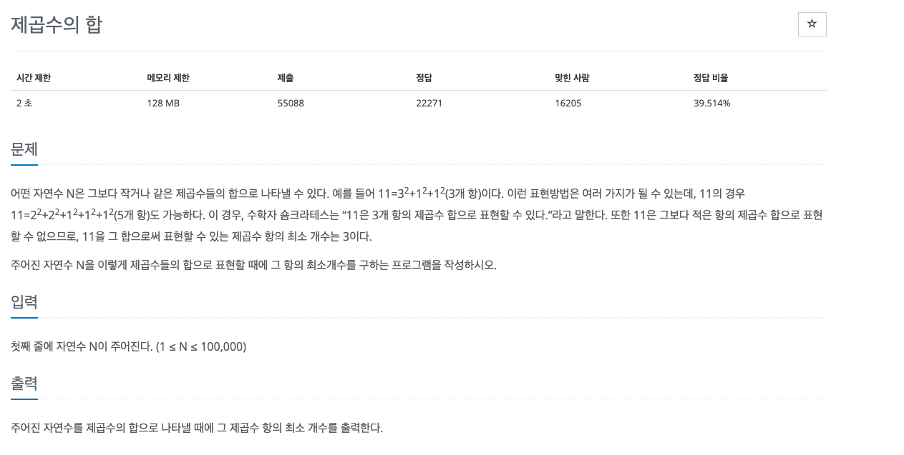
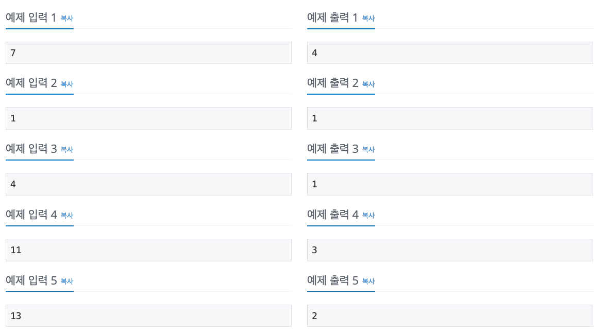

## 문제해결
이 문제는 손으로 직접 써보고 나서 이해하기 쉬웠다.   
여기서도 dp[N]의 값은 제곱수의 최소 갯수가 저장된다.   
N = 11을 기준으로 보자면
쉽게 표시를 하기위해 지수는 생략하고 밑 수만 표기하면   
- dp     제곱수   갯수  
- dp[1] = 1 =     1; 
- dp[2] = 1 + 1 = 2;
- dp[3] = 1 + 1 + 1 = 3;
- dp[4] = 2 = 1;
- dp[5] = 2 + 1 = 2;
- dp[6] = 2 + 1 + 1 = 3;
- dp[7] = 2 + 1 + 1 + 1 = 4;
- dp[8] = 2 + 2 = 2;
- dp[9] = 3 = 1;
- dp[10] = 3 + 1 = 2;
- dp[11] = 3 + 1 + 1 = 3;
와 같다.   
예전에 배운 가우스법칙을 떠올리면 11을 나타내기 위해서
- 10 + 1
- 9 + 2
- 8 + 3
- 7 + 4
- 6 + 5
와 같이 나타낼 수 있다. 
위 값을 잘 살펴보면 N = 11 일 때   
[N - 1] + [1]
[N - 2] + [2]
...
[N - 5] + [5]
즉, [N - i] + [i] 가 된다.  
이 문제를 bottom-up 방식으로 풀어낸다면 아래와 같을 것이다.
- 아래 for 문을 살펴보면 먼저 
- min값을 초기값을 MAX_VALUE로 설정하고 
- 이중 for문에서는 i의 반만큼 for문을 순회한다.  
- 만약, j xj 가 i 와 같다면 즉, 3 x 3 = 9와 같이 곱하여 같다면
- min 값은 1로 초기하고 다음으로 넘어간다.
- 그게 아니라면 min값과 dp[i - j] + dp[j] 중에 큰 값을 min에 저장한다.
- 마지막에 min값을 dp[i]에 저장한다.
```java
for(int i = 2; i <= N; i++) {
    int min = Integer.MAX_VALUE;

    for(int j = 1; j <= i / 2; j++) {

        if(j * j == i) {
            min = 1;
            break;
        } else {
            min = Math.min(min, dp[i - j]  + dp[j]);
        }
    }

    dp[i] = min;
}
```

- 위의 for문을 이해했다면 다음으로 불 필요한 계산을 줄이는 방법이 있을 것이다.
- 여기서는 **제곱 수**가 포인트인데, 제곱 수로 나타낼 수 있는 수가 있다면 최소 갯수 1이된다.
- 1, 4, 9, 16 과 같이 = 1^1, 2^2, 3^2, 4^2와 같은 값들이다.    
- 다시말해,
- 10 + 1
- 9 + 2
- 8 + 3
- 7 + 4
- 6 + 5
- 와 같이 다 계산할 필요없이 11아래에 존재하는 제곱 수 끼리만 비교를 하면 된다는 말이다.
- 11아래에 있는 제곱수는 1, 4, 9 가 있다.   
- 즉, 
- 10 + 1 [1^1]
- 7 + 4 [2^2]
- 2 + 9 [3^2]
값만 비교하면 된다. 이 조건을 가지고 다시 for문을 나타내면 아래와 같다.
- 바깥 for문은 2 ~ N까지 순회한다.
  - 1을 하지않는 이유는 1로 고정이기때문에. 
  - 1은 1^2 값 즉, dp[1] = 1 이 초기값으로 들어가게된다.
- for문에서는 기본적으로 1^2만으로 나타낸 수를 dp[i]에 초기화한다.
  - 1^2로 나타내는 수는 1 + 1+ 1.... = i 즉, i개만큼 1이 더해진다.
- 내부 for문에서는 위에서 말했던 숫자 N 아래에 있는 제곱만을 게산할 수 있도록 조건으로 
- j*j <= i 로 설정하였다.
- for문 내부에서는 dp[i]값과 dp[i - j*j] + 1 중 작은 값을 dp[i]에 저장한다
- 예를들어 i = 11 일때, 
- dp[11] = Math.min(dp[11], dp[11 - 1(10)] + 1);
- dp[11] = Math.min(dp[11], dp[11 - 4(7)] + 1);
- dp[11] = Math.min(dp[11], dp[11 - 9(2)] + 1);
- 중 작은 값을 dp[11]에 저장한다.
- 여기서 + 1을 하는 이유는 제곱 수의 갯수이다.
- 헷갈리지 말아야 할 것은 구하려는 값은 숫자가 아닌 **제곱의 갯수**이다.
- dp[10] + 1 [1^1] = dp[10] + 1
- dp[7] + 4 [2^2] = dp[7] + 1
- dp[2] + 9 [3^2] = dp[2] + 1
```java
private static int bottom_up2(int N) {

    for(int i = 2; i <= N; i++) {
        dp[i] = i;
        for(int j = 1; j * j<= i; j++) {
            dp[i] = Math.min(dp[i], dp[i - j*j] + 1);
        }
    }

    return dp[N];
}
```

- N을 입력받아 dp배열을 초기화한다
- 이 때 초기화는 N + 1로 한다.
- 이유는 인덱스가 0부터 시작하기 때문이고, 문제에서 1부터 시작하기 때문에
```java
static Integer[] dp;

BufferedReader br = new BufferedReader(new InputStreamReader(System.in));

int N = Integer.parseInt(br.readLine());

dp = new Integer[N + 1];
```
- 초기값을 설정한다
```java
dp[0] = 0;
dp[1] = 1;
```
- bottom-up으로 dp값을 초기화한다.
```java
private static int bottom_up2(int N) {

    for(int i = 2; i <= N; i++) {
        dp[i] = i;
        for(int j = 1; j * j<= i; j++) {
            dp[i] = Math.min(dp[i], dp[i - j*j] + 1);
        }
    }

    return dp[N];
}
```
- bottom-up 메서드를 호출하여 출력한다.
```java
System.out.println(bottom_up2(N));
```