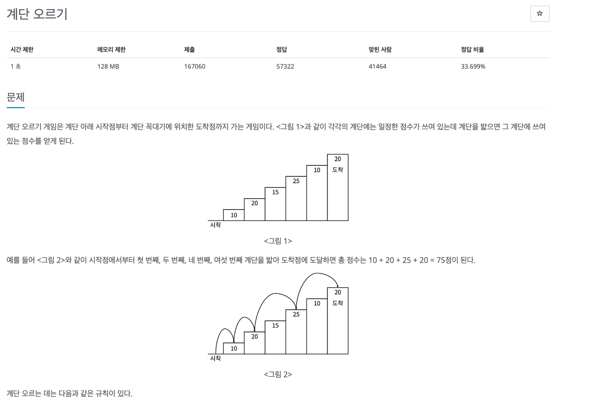
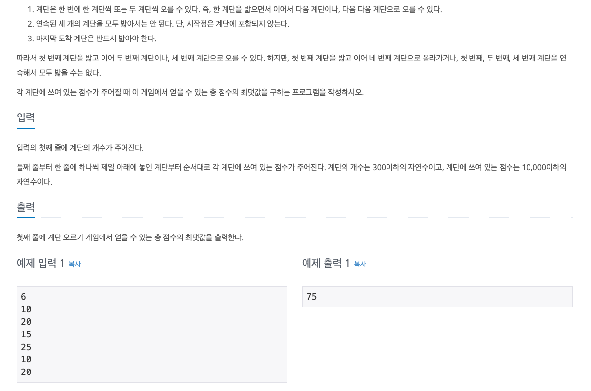

## 문제해결
이 문제의 키 포인트는 **마지막 계단을 밟는다**에 있다.   
마지막에 밟는 계단이 N 이라고 했을 때, N을 밟을 수 있는 조건은 2가지가 있다.   

1. N 과 N - 1 계단을 밟는다면 N - 2는 밟을 수 없기 때문에 N -3 까지 누적된 값을 더한다.
   - 즉, (dp[N - 3] (N -3 까지의 누적합) + number[N] + number[N - 1]) 이 될 것이다.
2. 다음으로는 N - 1을 밟지 않을 경우이다. 이때는, N 과 N - 2까지의 누적된 값을 더하게 된다.
   - dp[N - 2] + number[N] 

이렇게 보고 나면 쉽게 문제를 해결할 수 있다.   


### top-down
top-down 문제는 위에서 아래로 진행하며 재귀를 통해 dp를 초기화한다는 것을 기억하자.   

- N을 입력받는다.
- 입력받은 N으로 계단의 배열과 dp배열을 초기화한다.
- dp배열에는 각각의 계단에 누적합이 저장된다.
```java
static int[] stairs;
static Integer[] dp;

BufferedReader br = new BufferedReader(new InputStreamReader(System.in));

int N = Integer.parseInt(br.readLine());

stairs = new int[N + 1];
dp = new Integer[N + 1];
```
- 계단을 입력받아 stairs 배열을 초기화한다.
```java
for(int i = 1;i <= N; i++) {
    stairs[i] = Integer.parseInt(br.readLine());
}
```
- 초기값을 설정한다.
  - 초기값으로는 dp[0]= 0; 
  - dp[1] 의 값으로는 이 전값이 없기 때문에 dp[1] = stairs[1] 이 된다.
  - dp[2] 또한 초기화를 해주는데, 이 때는 N 이 1보다 클 때 즉, 2부터 초기화가 가능하게 한다.
    - 이유는 N = 1 을 입력받았을 때 dp[2]에 접근하려고 할 때 오류가 발생하기 때문이다.
  - dp[2] 까지 초기화하는 이유는 잘 생각해보면 이후에 나올 재귀함수에서 dp[N - 3] 까지 접근하기 때문이다.  까지
```java
dp[0] = 0;
dp[1] = stairs[1];

//조건을 추가하지않으면 N = 1일 때, dp[2], stairs[2]에 접근하려다 오류 발생함.
if (N >= 2) {
    dp[2] = stairs[1] + stairs[2];
}
```
- 재귀함수를 통해 dp를 초기화한다.
  - 재귀함수 내에서는 dp[N]이 초기화 되지 않았을 때 dp[N] 값을 초기화한다.,
  - 위에서 설명한 dp[N - 2]까지 밟고 stairs[N]을 밟는 조건과
  - dp[N - 3] 까지 밟고 stairs[N - 1] + stairs[N] 두개를 밟는 조건 중 더 큰 값을 dp[N]에 저장한다.
```java
private static int recur(int N) {
    
    if(dp[N] == null) {
        dp[N] = Math.max(recur(N - 2), recur(N - 3) + stairs[N - 1]) + stairs[N];
    }

    return dp[N];
}
```


