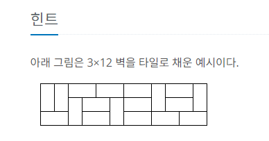
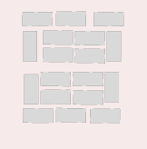

## 문제 풀이
타일문제와 같은 경우는 하나씩 적어보는 것이 많은 도움이 됩니다.   
먼저 이 문제에 있어서 [2x1], [1x2]로 3 X N의 크기의 벽을 채우는 것인데,   
[2x1], [1x2]의 타일로는 N이 홀수인 벽은 채울 수 없다.   
채울 수 없다는 것에 대해서는 따로 설명하지 않겠습니다. 그려보면 바로 알 수 있기 때문입니다.  
- **여기서 조건으로 [N % 2 == 1 return 0]을 얻을 수 있습니다.**  

다음으로 N = 0일때를 생각해봐야하는데, [3x0]이라는 벽을 [2x1], [1x2]라는 타일로 채울 수 있는가에 대한 답은   
1이다. 이 후에 나올 조건에 부합하기 위해 N = 0에 대하여 갯수는 1로 설정하는 것이다.   
이해가 되지 않는다면 이후에 나올 규칙을 통해 답을 구할 때 가장 작은 수를 대입해볼 때 알 수 있다.   

다음으로 N = 짝수일 때 이다. 차근차근 작은 수에서 부터 규칙을 찾아가 보자.   
N = 2 일때 [3x2] 의 벽을 채우는 방법은 아래와 같이 **3**개가 그려진다.  
    
이 타일은 N = 짝수일 때만 성립하는 문제에 있어 중요한 타일들이니 기억해두자.   
이 타일들을 tile[1], tile[2], tile[3]이라 지칭하겠다.  
N = 2 의 값은 3이다.


N = 4[3x4]일때는  N = 2 일때 그렸던 타일[3x2]의 뒤쪽으로 tile[1~3]의 타일을 똑같이 붙여서 채울 수 있다.    
    
N = 4 부터는 특별한 타일들이 들어가게 되는데, [3x2]에 [3x2] 타일을 붙이는 것 이외에도 아래와 같은 타일을 붙일 수 있다.   
   
N = 4 의 값은 11이다. 

N = 6 일때는 붙일 수 있는 방법이 크게2가지가 있는데,   
- [3x2] 타일에 [3x4] 타일을 붙이는 방법.
- [3x4] 타일에 [3x2] 타일을 붙이는 방법.
이 있을 것이다.   
단순하게 생각을 해보면 [3x4] 타일이 기준이 되고, [3x4]타일 앞 뒤로 [3x2] 타일을 붙인다고 생각할 수 있는데,   
- [3x4][3x2]
- [3x2][3x4]
그렇게 계산해본다면 총 갯수는 33 x 2 + 2 x 33 으로 66이 나올 것이다.   
하지만 이 둘을 직접 그려본다면 중복되게 붙여지는 타일이 있다는 것을 확인할 수 있다.  
tile[1~3]으로 [3x6]을 채우는 방법으로는 [3x2][3x4], [3x4][3x2] 는 동일하다는 것을 알 수 있다.    

- [3x2] 타일을 [3x4] 타일의 왼쪽에 붙인 그림 (33개)
 
- [3x2] 타일을 [3x4] 타일의 오른쪽에 붙인 그림 (33개)


사진에서 볼 수 있듯이 동일하다는 것을 알 수 있다. 그렇다면 다른게 있을까?   
있다. N = 4 일 때 채웠던 방법 중 [3x2]으로 채우는 방법 이외에도 특별한 타일이 있었다는 것을 기억할 것이다.   
이 타일[3x4]을 기준으로 왼, 오른쪽에 [3x2]의 타일을 붙인다면 중복되지 않는다.   

- [3x4] 특별 타일의 왼쪽에 [3x2] 타일을 붙인 그림 (3개)

- [3x4] 특별 타일의 오른쪽에 [3x2] 타일을 붙인 그림 (3개)


마지막으로 N = 4 일때와 동일하게 특별한 타일로 벽을 채울 수 있다.  

여기서 규칙성이 보이는데, 짝수만큼 늘어날 때마다 특별한 타일은 **2**개 씩 생긴다는 것이다.   
N = 6 의 값은 41이다. [33 + 2x3(3x4특별타일 x 3x2) + 2(3x6 특별 타일)]

이제 N = 8 에 대하여 유추를 해보자면,
- [3x6] [3x2] 로 벽을 채우는 방법
- [3x4] [3x4] 로 벽을 채우는 방법
- [3x2] [3x6] 로 벽을 채우는 방법
여기서도 동일하게 [3x2]로만 벽을 채운다면모든 방법에 있어서 중복이 일어 날 것이다.   
다시말해 [3x2]로만 벽을 채우는 방법은 윗 방법 3개중에서 1번만 진행하면 된다는 것이다.   
처음 [3x2][3x6]로 벽을 채우는 방법의 갯수를 구한다면 3 x 41 = 123 이 될 것이고,   
[3x4][3x4]에 대하여 [3x4]의 갯수 **11**에 [3x4]의 특별 타일 2개를 곱한 11 x 2 = 22 이다.  
다음으로 [3x6][3x2]에 대해서는 [3x6]의 특별타일 갯수 **2**에 [3x2] 타일 3개를 곱합 2 x 3 = 6.
마지막으로 여기서도 동일하게 특별타일 **2개**가 나온다.  

N = 8의 값은 123 + 22 + 6 + 2 = 153 이다.   

이제 규칙을 보자면,   
dp[N] = (dp[N - 2] * dp[2]) + (dp[N - 4] * 2(특별타일)) + (dp[N - 6] * 2) ... (dp[N - N = 0] * 2)   
- 여기서 dp[0] = 1 인 이유를 알 수 있다. 
- dp[0]은 특별타일을 나타내기 위한 값이다.
- 이것이 이해가 되지 않는다면, bottom-up으로 짠 코드의 설명에서 마지막 부분을 보면된다.   
이란 규칙을 찾을 수 있다.  
이제 코드로 바꿔보면 아래와 같다.

- N을 입력받는다. 만약 N이 홀수라면 0을 출력하고 리턴한다.
```java
BufferedReader br = new BufferedReader(new InputStreamReader(System.in));

int N = Integer.parseInt(br.readLine());

if(N % 2 == 1) {
    System.out.println(0);
    return;
}
```
- 입력받은 N으로 N + 1 크기의 dp배열을 만든다.
  - dp배열은 타일의 갯수를 저장하는 배열이다.
```java
dp = new Integer[N + 1];
```
- dp배열의 초기값으로
- dp[0] = 1;
- dp[1] = 0;
- dp[2] = 3;
으로 초기화 해준다.
```java
dp[0] = 1;
dp[1] = 0;
dp[2] = 3;
```

### bottom-up
- bottom-up으로 문제를 풀자면, 바깥 for문은 4부터 시작하여, 2씩 증가한다.   
  - 위에서도 말 했듯이 타일은 짝수에서만 가능하기 때문이다.  

- for문 안에서는 기본적인 타일의 갯수인 dp[i - 2] * dp[2]의 갯수로 dp[i]를 초기화한다.   
- 다음 내부 for문에서는 i - 4 부터 시작하여 0까지 순회하며 2씩 감소한다.
- i - 4 부터 0까지 순회하는 것은 짝수일 때 붙인 타일에 있어서 특별타일에  x2 한 값을 구하기 위해서이다.
  - dp[N] = dp[N - 2] * dp[2] + (이 부분) dp[N - 4] * 2 + dp[N - 6] * 2 ...
  - i-4 부터 시작하는 이유는 앞에서 기본값인 dp[i -2] * dp[2] 이후의 값이기 때문이다.
  - 예를들어 i = 8 이라면 기본값인 dp[i - 2 (6)] * dp[2] 를 하고
  - 이 후 부터는 특별타일에 x2 한 값을 구하기 때문이다. dp[i - 4(4)] * 2
  - 따라서, i = 8 일때는 dp[8] = (dp[6] * dp[2]) + (dp[4] * 2) + (dp[2] * 2) + (dp[0] * 2) 가 된다.
    - dp[0] = 1 인 이유를 여기서 명확히 확인할 수 있는데, 
    - N = 8 일때를 살펴보면 123 + 22 + 6 + 2 = 153 이란 값을 구할 수 있는데,  각각 매치를 해보면 
    - dp[6] * dp[2] = 123
    - dp[4] * 2 = 22
    - dp[2] * 2 = 6
    - dp[0] * 2 = 2 (특별타일)
    - 란 것을 알 수 있다.
```java
static void bottom_up(int N) {

    for(int i = 4; i <= N; i+=2) {
        dp[i] = dp[i - 2] * dp[2];

        for(int j = i - 4; j >= 0; j-=2) {
            dp[i] += dp[j] * 2;
        }
    }
}
```

### top-down
bottom-up을 이해했다면  bottom-up에서 dp[i - 2], dp[j] 부분을 재귀를 통해 구하면 된다.
```java
static int top_down(int N) {

    if(dp[N] == null) {
        dp[N] = top_down(N - 2) * dp[2];

        for(int i = N - 4; i >= 0; i -=2) {
            dp[N] += top_down(i) * 2;
        }
    }

    return dp[N];
}
```


#### 참고 : https://yabmoons.tistory.com/536