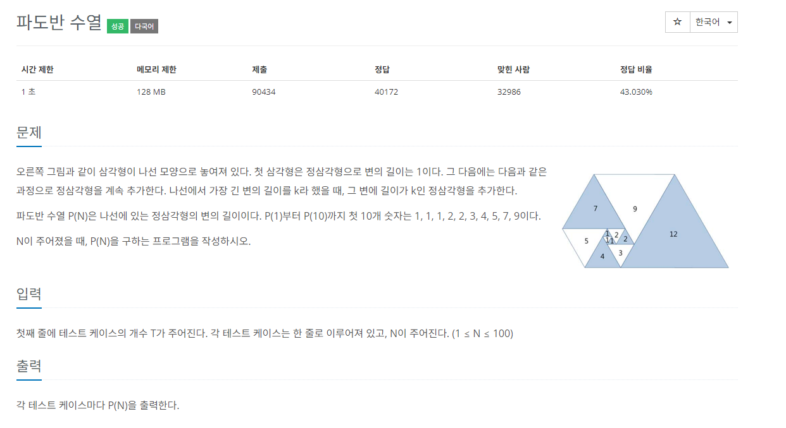
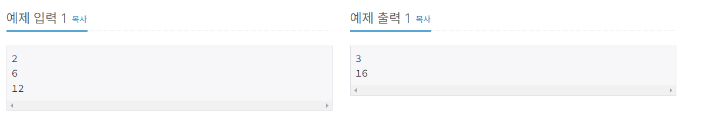
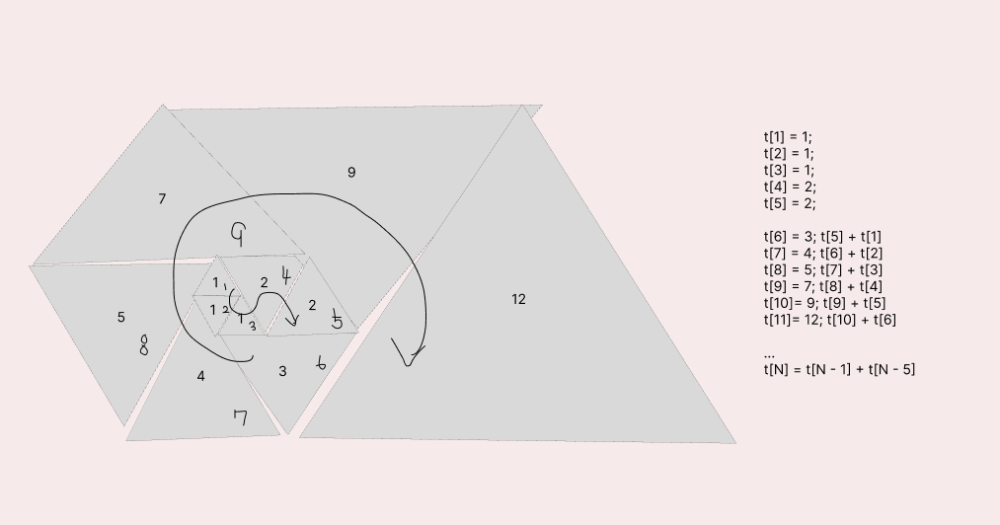

## 문제해결
이 문제는 손으로 그려보는게 가장 빠르게 해결할 수 있다.  
그림을 그려보면 아래와 같은데, 이 문제에서는 초기값을 설정하는 것이 중요하다.  

그림을 살펴보면 규칙은 6부터 찾을 수 있기 때문에, 1 ~ 5 까지의 설정을 잘 해줘야 한다는 것이다.   
이유는 입력을 받을 때 dp의 값을 초기화 할텐데, 1~5를 조건없이 초기화 시 arrayIndexOutOfBounds 오류가 날 수 있기 때문이다.   

- 테스트 케이스 T를 입력받는다.
```java
BufferedReader br = new BufferedReader(new InputStreamReader(System.in));
StringBuilder sb = new StringBuilder();


//test case
int T = Integer.parseInt(br.readLine());
```
- 테스트 케이스만큼 for문을 돌면서 N을 입력받는다.
- 입력받은 N으로 dp배열을 초기화한다.
  - dp배열은 삼각형의 값을 저장한다.
- 0,1은 기본적으로 초기화 가능하다 . (1 <= N <= 100)
- 2부터는 입력받은 N과 비교하여 속하면 해당 값을 초기화한다.
```java
for(int i = 0; i < T; i++) {
    // 1<= N <= 100
    int N = Integer.parseInt(br.readLine());

    dp = new Long[N + 1];
    dp[0] = 0L;
    dp[1] = 1L;
    if(N >= 2) {
        dp[2] = 1L;
    }
    if (N >= 3) {
        dp[3] = 1L;
    }
    if(N >= 4) {
        dp[4] = 2L;
    }

    if (N >= 5) {
        bottom_up(N);
    }

    sb.append(dp[N]).append("\n");
}

System.out.println(sb);
```
### bottom-up
bottom-up으로 푸는 방법은 위에서 말했듯이 6부터 규칙이 존재하기 때문에  
6부터 시작하여 N까지 돌며 dp[N] = dp[N - 1] + dp[N - 5]의 값을 초기화한다.

```java
static void bottom_up(int N) {
    for(int i = 5; i <= N; i++) {
        dp[i] = dp[i -1] + dp[i - 5];
    }
}
```