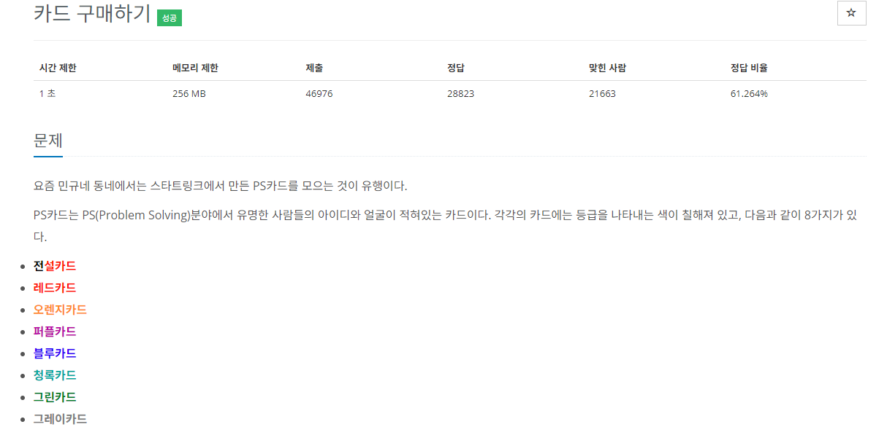
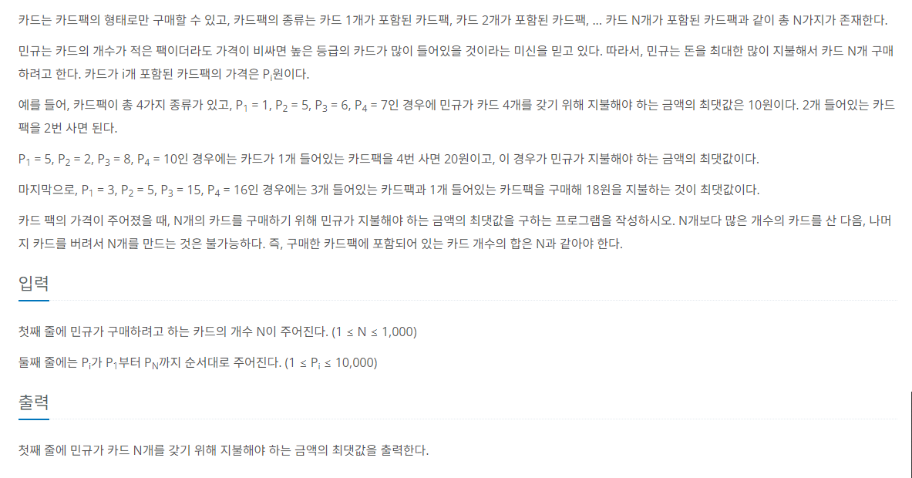
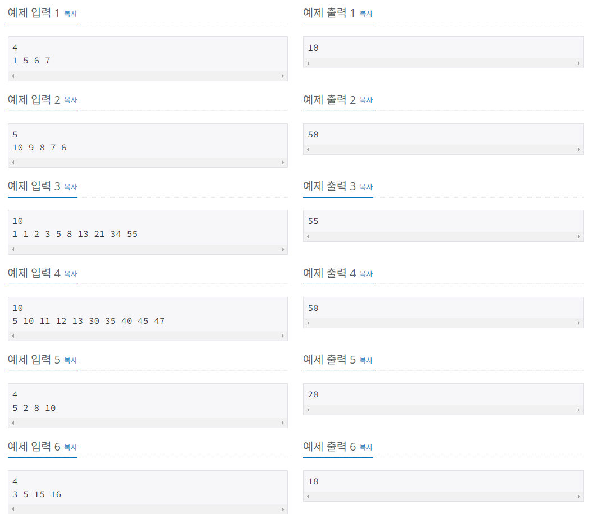

## 문제 해결
이 문제를 풀기 전 dp배열에 들어가는 값은 N원에 대하여 구매할 수 있는 최대 가격이 들어가게 된다는 것을 미리 말씀드린다.  
예시출력  
4   
1 5 6 7   
을 가지고 예시를 들면 문제를 풀어보도록 하겠다.   
위 예시를 자세히 쓰자면  
N = 4   
cards[1] = 1;  
cards[2] = 5;   
cards[3] = 6;    
cards[4] = 7;    
라고 표현할 수 있다.   
하나씩 하나씩 풀어나가 보자.   
먼저 N = 1 즉, 카드 1개를 사기위해서는 cards[1] 만의 값 밖에 안될 것이다.   
dp[1] = cards[1]; 이 값은 초기값으로 사용된다.    
dp[1] = 1

다음으로 N = 2, 카드 2개를 사기위한 최대 금액은 아래와 같다.   
- 카드 2개가 든 팩을 한개살 때  
  - dp[2] = cards[2] = 5;    
- 카드 팩 1개를 사고, 이 전에 구한 1개를 사기위한 최대금액으로 더하여 총 2개를 살 때 
  - dp[2] = dp[1] + cards[1] = 2;
- 위 두 조건을 비교해보면 더 큰 금액인 카드2개가 든 팩을 살 때인 5가 dp[2]에 할당된다.  
- dp[2] = 5;

N = 3, 카드 3개를 사기위한 최대 금액
- 카드 3개가 든 팩을 한개만 살 때
  - dp[3] = cards[3] = 6;
- 카드 2개가 든 팩을 사고, 이 전에 구한 1개를 사기위한 최대금액으로 총 3개를 살 때
  - dp[3] = dp[1] + cards[2] = 6;
- 카드 1개가 든 팩을 사고, 이 전에 구한 2개를 사기위한 최대금액으로 총 3개를 살 때
  - dp[3] = dp[2] + cards[1] = 6;
- 위에서 구한 조건을 비교하여 제일 큰 값을 dp[3]에 할당한다
- dp[3] = 6;

N = 4 일 때는 아래와 같다
- 카드 4개가 든 팩을 살 때
  - dp[4] = cards[4] = 7;
- 카드 3개가 든 팩을 사고 1개를 사기위한 최대금액
  - dp[4] = dp[1] + cards[3] = 7;
- 카드 2개가 든 팩을 사고 2개를 사기위한 최대금액
  - dp[4] = dp[2] + cards[2] = 10;
- 카드 1개가 든 팩을 사고 3개를 사기위한 최대금액
  - dp[4] = dp[3] + cards[1] = 7;
- dp[4] = 10;


규칙이 보일 것이다.   
N = 2
- (dp[0]) + cards[2];
- dp[1] + cards[1];
N = 3
- (dp[0]) + cards[3];
- dp[1] + cards[2];
- dp[2] + cards[1];
N = 4
- (dp[0]) + cards[4];
- dp[1] + cards[3];
- dp[2] + cards[2];
- dp[3] + cards[1];
다시말해, dp의 값은 0 부터 1씩 증가하고, cards의 값은 N부터 1까지 줄어든다는 것을 알 수 있다.   
```java
for(int i = 1; i < N; i++) {
    for(int j = 0; j < i; j++) {
        dp[i] = dp[j] + cards[N - j];
    }
}
```
와 같은 규칙을 코드로 작성할 수 있다.   
여기서 몇가지를 더 추가해야 하는데,   
기본적으로 dp[i]의 값은 cards[i]의 값이 할당된다.  즉, 각각 N의 첫 번째 조건의 값이 초기값이 된다는 것이다.   
다음으로는 N을 구할 수 있는 조건들 중에서 가장 큰 값을 dp[i]에 할당해야 한다는 것이다.   
위 조건을 추가하여 코드로 다시표현 하자면
```java
for(int i = 1; i < N; i++) {
    for(int j = 1; j < i; j++) {
        dp[i] = Math.max(dp[i], dp[j] + cards[N - j]);
    }
}
```

- N을 입력받아 cards[], dp[] 을 초기화한다.
  - N + 1 인 이유는 N이 1부터 시작하기 때문에,
```java
 BufferedReader br = new BufferedReader(new InputStreamReader(System.in));

int N = Integer.parseInt(br.readLine());

cards = new int[N + 1];
dp = new Integer[N + 1];
```
- 다음으로 입력받는 카드값을 cards[]에 저장한다.
```java
StringTokenizer st = new StringTokenizer(br.readLine(), " ");

for(int i = 1; i <= N; i++) {
    cards[i] = Integer.parseInt(st.nextToken());
}
```
- 초기값을 설정한다.
  - dp[0] = 0;
  - dp[1] = cards[1];
```java
dp[0] = 0;
dp[1] = cards[1];
```

### bottom-up
위에서 규칙을 갖고 만든 코드로 bottom-up방식으로 dp배열을 초기화한다.
```java
static void bottom_up(int N) {
    for(int i = 2; i <= N; i++) {
        dp[i] = cards[i];
        for(int j = 1; j < i; j++) {
            dp[i] = Math.max(dp[i], dp[j] + cards[i - j]);
        }
    }
}

```
- bottom-up method를 호출하고 dp[N]을 출력한다.
```java
bottom_up(N);
System.out.println(dp[N]);
```


