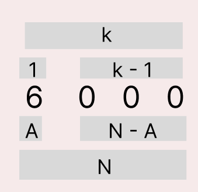

## 문제해결
이 문제는.. 어려웠다..    
이 문제도 동일하게 손으로 하나하나 적어보며 풀었고, 해결하지 못하여 검색하여 도움을 받은 문제이다.    
이 문제는 두 부분으로 나누어 생각할 수 있다.   
- 숫자의 가장 앞부분
- 앞부분을 제외한 나머지 부분

윗 그림처럼 볼 수 있다.   
윗 그림을 조금 더 설명하자면, 이 문제는 K개의 수를 가지고 N을 표현하는 것이다.   
가장 앞의 값을 제외한 K - 1갯수를 가지고 N - A만큼의 수를 표현하면 된다.   
이렇게 두 부분으로 나눈 이유는 단순하게는 for문을 돌리기 위해서이다.    
다르게 생각하면 A의 수는 중요치 않고 나머지 N - A 의값을 통해 규칙을 찾을 수 있다.   
여기서 dp배열은 2차원배열로 표현하며, k개로 N을 표현할 수 있는 방법 (dp[K][N]) 으로 선언한다.

문제를 풀기 전 초기값에 대해 생각을해보자.   
먼저 K = 1 일때 어떠한 수 N [1 <= N <= 9] 에 대하여 값은 무조건 1이 나올것이다.   
1자리의 수로 표현할 수 있는 개수는 1개 밖에 없기 때문이다. [K = 1]    
다음으로 N = 0 일때 K와 관계없이 갯수는 1개가 나온다.  
예를들어 N = 0이고, k = 1일때 [0], K = 2 [0 , 0], k = 3[0, 0, 0] 0 끼리는 자리를 바꾸어도    
같은 갯수이기 때문이다.    [N = 0]   

이제 예시를 들어 하나씩 풀어가보도록 하자.   
예시출력인 6, 4를 예를 들어 설명하자면    
N = 1 이고, K = 2 일 때 표현할 수 있는 가짓수는   
A = 1 일때, 나머지 K - 1 개에서 0을 표현하는 [1, 0],    
A = 0 일때, 나머지 K - 1이 1을 표현하는 [0, 1] 이 될 것이다.  
어렵게 설명한것 같으니 아래 예시를 더 들어보도록 하겠다.   
N = 1, K = 3 일 때, 나타낼 수 있는 가짓수는   
- A = 1 일때, K - 2 에서 0을 표현하는 방법 [1, 0, 0]
- A = 0 일때, K - 2 에서 1을 표현하는 방법 [0 ,1, 0], [0, 0, 1]

1이 이해가 어려우니 다른 수를 예로 들어보자면   
N = 2, K = 3 일 때  
- A = 2 일때 K - 1 에서 0을 표현하는 방법 [2, 0, 0]
- A = 1 일때 K - 1 에서 1을 표현하는 방법 [1, 1, 0] [1, 0, 1]
- A = 0 일때 K - 1 에서 2을 표현하는 방법 [0, 2, 0] [0, 0, 2]    

빠른 이해를 돕기위해  
이 규칙을 표로 표현하자면 아래와 같다.
   
표를 보고 있으면 규칙이 보이는가?   
예를들어서 N = 2, K = 3 일 때를 보면   
dp[3][2] = dp[2][0] + dp[2][1] + dp[2][2] 인데, 여기서   
dp[2][2] 는 dp[3][2]의 위에 존재하고, dp[2][0] + dp[2][1]은 dp[3][2]의 왼쪽에 존재한다.   
다시말해, dp[3][2] = dp[3][1] + dp[2][2]가 성립한다는 것이다.
  
해당 규칙을 점화식으로 표현하자면   
dp[K][N] = dp[K][N - 1] + dp[K - 1][N] 이 된다.   

- K, N을 입력받아 dp배열을 초기화한다.
  - +1 해주는 이유는 입력받는 값은 1부터 시작이고 인덱스는 0부터 시작하기 때문에
```java
BufferedReader br = new BufferedReader(new InputStreamReader(System.in));
StringTokenizer st = new StringTokenizer(br.readLine(), " ");

// 1<= N <= 200
int N = Integer.parseInt(st.nextToken());
// 1<= K <= 200
int K = Integer.parseInt(st.nextToken());

dp = new Integer[K + 1][N + 1];
```
- 초기값을 설정해준다.
  - k값이 어떤것이든 0을 표현하는 방법은 1이다.
  - k = 1 일때는 어떠한 값을 표현해도 1이다.
```java
// dp[K][0] = 1;
for(int i = 1; i <= K; i++) {
    dp[i][0] = 1;
}

//dp[1][N] = 1;
for(int i = 0; i <= N; i++) {
    dp[1][i] = 1;
}
```
- 다음으로 위에서 구한 규칙을 갖고 나머지 dp배열값을 채운다.
  - 위의 표를생각하면 k값은 row가 되고, n은 column이 된다.   
  - 다시말해 for문의 바깥은 row에 해당하는 Ks이고, 
  - 안 쪽 for문은 column의 해당하는 N이 된다.
```java
for(int i = 2; i <= K; i++) {
    for(int j = 1; j <= N; j++) {
        //dp[K - 1][N] + dp[K][N - 1]
        dp[i][j] = (dp[i - 1][j] + dp[i][j - 1]) % mod;
    }
}

System.out.println(dp[K][N]);
```
