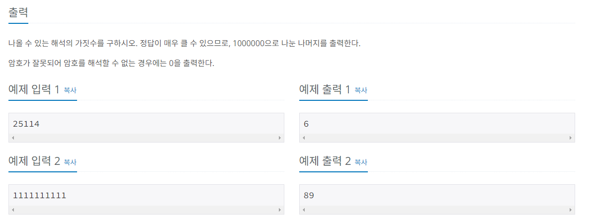

## 문제해결  
몇 가지 조건을 살펴보도록 하자.    
이 문제를 풀기위해서는 기본적은 규칙을 찾는 것과   
규칙에 대하여 예외의 조건을 찾는 것이다.   
먼저 암호를 만들기 위해서는 1 <= X <= 26  범위에 존재해야 한다는 것을 명심하자.    
이 문제에서 dp에 저장되는 값은 각각의 문자열에 대하여 만들 수 있는 암호의 숫자가 저장된다.  
예시 출력인 [25114] 을 가지고 문제를 풀어보도록 하자.    
이 문제를 바라볼 떄는 **암호의 갯수**를 중점으로 생각하며 풀자.   


먼저 [2] 일때 만들 수 있는 암호의 수는 2 뿐이다.
- [2] = (2)
- dp[1] = 1;
다음으로는 [2,5] 일 때는 
- [2, 5] = (2, 5) , (25)
- dp[2] = 2;
다음으로는 [2, 5, 1] 일때이다. 이때는 조금 특별한데
- [2, 5, 1] = (2, 5, 1), (25, 1), (51, 1)  
이렇게 3개를 만들 수 있지만 51이란 숫자는 x의 범위(1 <= X <= 26)를  
넘어가기 때문에 만들 수 없다.    
다시말해, [2, 5, 1]로 만들 수 있는 것은 (2, 5, 1), (25, 1) 이다.  
- (2,5,1), (25, 1)
- dp[3] = 2;
[2,5,1,1]일때는 
- [2,5,1,1] = (2,5,1,1), (25,1,1), (2, 51, 1), (2, 5, 11), (25, 11)
여기서도 동일하게 (2, 51, 1)로는 암호를 만들수 없다. 
- (2,5,1,1), (25,1,1), (2,5,11), (25,11)
- dp[4] = 4;
마지막으로 [2,5,1,1,4]
- [2,5,1,1,4] = (2,5,1,1,4), (25,1,1,4), (2,51,1,4), (2,5,11,4), (2,5,1,14), (25,1,14) 
- 동일하게 51는 만들수 없다.
-  (2,5,1,1,4), (25,1,1,4), (2,5,11,4), (25,11,4), (2,5,1,14), (25,1,14)
혹시 여기까지 해서 규칙이 보이는가? 안 보인다면 더 살펴보도록 하자.   

위에서 구한 것을 모아보면  
1.[2] = (2)  
2.[2,5] = (2,5) (25)  
3.[2,5,1] = (2,5,1), (25,1)  
4.[2,5,1,1] = (2,5,1,1), (25,1,1), (2,5,11), (25,11)  
5.[2,5,1,1,4] = (2,5,1,1,4), (25,1,1,4), (2,5,11,4), (25,11,4), (2,5,1,14), (25,1,14)     

#### 일반적인 규칙

- 먼저 일반적인 상황에서의 규칙을 찾아보도록 하자.   
  [2,5,1,1,4] 일 때를 살펴보면 [2,5,1,1] 일때의 암호 뒤에 4를 붙인 것 + [2,5,1] 일때의 암호 뒤에 14를    
  붙인 것을 더한 값이  [2,5,1,1,4] 를 표현한다는 것을 볼 수 있다.  
  이 규칙을 바꿔보면   
  dp[N] = dp[N - 1] + dp[N - 2] 가 된다는 것을 알 수 있다. (9 < X < 27)

- 다음으로는 2개의 수를 합하여 9 < X < 27 의 범위를 넘어 갈 때 이다.   
  이 조건은 [2,5,1] 에서 살펴 볼 수 있다.  
  [2,5,1] 에서 (2,5,1), (25,1), (2,51) 로 표현할 수 있겠지만   
  (2, 51)은 사용할 수 없다는 것을 알 수 있다 (9 < X < 27)   
  그렇다면 사용할 수 있는것은 (2,5,1), (25,1) 인데 이 수들은   
  [2, 5] 의 뒤에 (1)을 합한 것과 같다.    
  이 규칙을 바꿔보면  
  dp[N] = dp[N - 1];가 된다. (x < 9 or x > 26)

이것을 코드로 보자면  

```java
int two_number = Integer.parseInt(password.substring(i - 1, i + 1));

if (two_number > 9 && two_number < 27) {
    dp[N] = dp[N - 1] + dp[N - 2];
} else {
    dp[N] = dp[N - 1];
}
```


#### 끝이 0 으로 끝나는 규칙
다른 예외 조건이 있는지 살펴보자면 0에 대한 조건이다.   
예를들어서 [2,5,0] 이라는 수가 있을 때  
[2] = (2)    
[2,5] = (2,5), (25)    
[2,5,0] = (2,5,0), (25,0), (2, 50)    
을 표현할 수 있는데, 마지막 [2,5,0]을 살펴보면 (2,5,0) 란 암호를 표현할 수 있는데,    
0이란 수는 (1 <= X <= 9)에 속하지 않을 뿐더러 0이란 수로 암호를 표현하기 위해서는    
10 or 20 이 2개로만 표현이 가능한데, 0의 앞에는 5 (50) 이기 때문에 암호를 표현할 수 없다.    
이 조건을 살펴보자면
```java
if(password.charAt(N) == '0') {
    if (password.charAt(N - 1) == '10' || password.charAt(N - 1) == '20') {
        // [A]
    } else {
        break;
    }
}
```
그렇다면 [A] 부분에는 어떠한 규칙이 들어갈까? 이번에는 0 앞에 1 or 2 일때를 살펴보자.   
[2,2,0]  
1.[2] = (2)   
2.[2,2] = (2,2), (22)    
3.[2,2,0] = (2,20)    
보면 [2,2,0] 은 [2] 일때에 (20)을 추가한 것과 같다.   
dp[N] = dp[N - 2]; 란 규칙이 나온다.   
이 규칙은 위의 [A] 부분에 들어가게 된다.

```java
if(password.charAt(N) == '0') {
    if (password.charAt(N - 1) == '10' || password.charAt(N - 1) == '20') {
        dp[N] = dp[N - 2];
    } else {
        break;
    }
}
```

#### 숫자 사이에 0 이 있는 경우
다음으로는 숫자 사이에 0이 있을경우이다.   
위의 예시를 이어서 [2,2,0,1] 을 가지고 예시를 들어보자.   
1.[2] = (2)
2.[2,2] = (2,2), (22)
3.[2,2,0] = (2,20)
4.[2,2,0,1] = (2,20,1)
여기서는 [2,2,0] 일때에 뒤에 1을 붙인 것과 같다.   
생각해보면 0이 일의자리로 온다면, 앞에 수(2)에 붙을 수 밖에 없기 때문에    
0 이후의 수는 단순 추가되는 경우밖에 있지않다.   
따라서 위의 규칙을 코드로 보자면    

```java
if (password.charAt(i - 1) == '0') {
    dp[N] = dp[N - 1];    
}
```

이제 위에서 발견한 규칙을 갖고 문제를 풀어보자.  


- 암호를 입력받는다. 
  - static 변수로 결과에서 나눌 값 mod와, dp 배열을 선언한다.
```java
static int[] dp;
static int mod = 1_000_000;

BufferedReader br = new BufferedReader(new InputStreamReader(System.in));

String password = br.readLine();
```


#### 코드
이 문제에서는 문자열을 다루어서 문제를 풀기 때문에 기본적으로   
모든 인덱스에 -1을 하여 문제를 푼다.    


- 만약에 입력받은 암호의 첫 번째가 0 이라면 "0"을 출력한다.
```java
if(password.charAt(0) == '0') {
    System.out.println(0);
    return;
}
```
- 입력받은 암호숫자의 길이 + 1 의 크기로 dp배열을 초기화한다.
- dp배열의 초기값을 설정한다. 
  - dp[0] = 1;
    - 여기서 0을 1로 초기화한 이유는 뒤에서 볼 수 있지만 최소 규칙에 맞기 위해서이기도 하다.
  - dp[1] = 1;
```java
dp = new int[password.length() + 1];

dp[0] = 1;
dp[1] = 1;
```

- 이제 남은 password 만큼 순회를 돌며 규칙에 맞게 dp배열에 값을 넣는다.
  - for 초기값이 2 인 이유는 dp[0], dp[1]은 값이 대입되었기 때문에 dp[2] 부터 시작한다.
  - 여기서는 문자열을 다루기 때문에 기본적으로 i값을 인덱스 그대로 사용하면 원하는 답이 나오지 않는다.
  - 따라서 i에 모두 -1 씩 더 뺴서 문제를 푼다.
  - 즉, [2,2,0,1] 를 예시로 들자면  
  - i = 3 일떄 password[i] = [0]이 아닌 i = 3 일때 password[i -1] = [0] 이 되는 것이다.
  - 각각의 값에 모듈러 연산을 통해 값을 저장한다.
  - 모듈러연산을 통해 값을 저장하여도 값의 차이는 없다.
    - [1001 % 10] / [101 % 10] / [11 % 10] 의 값이 같음
```java
for(int i = 2; i <= password.length(); i++) {
    if(password.charAt(i - 1) == '0') {
        // [0] 일때 0의 앞 숫자가 1 or 2 인가?
        int prev_number = Integer.parseInt(password.substring(i - 2, i - 1));
        if(!(prev_number == 1 || prev_number == 2)) {
            //int[] 의 기본값은 0 이기때문에 따로 값을 초기화하지 않는다.
    //                    dp[i] = 0;
            break;
        } else {
            dp[i] = dp[i - 2] % mod;
        }
        //현재 기준으로 [0]이 앞에 있을 때 [2,2,0,1] 에서 현재 1일 경우
    } else if (password.charAt(i - 2) == '0') {
        dp[i] = dp[i - 1] % mod;
    } else {
        int two_number = Integer.parseInt(password.substring(i - 2, i));
    
        if (two_number > 9 && two_number < 27) {
            dp[i] = (dp[i - 1] + dp[i - 2]) % mod;
        } else {
            dp[i] = dp[i - 1] % mod;
        }
    }
}
```


