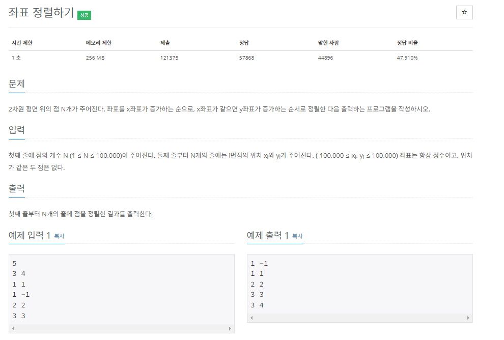

### 문제접근
입력받은 x,y 좌표를 가지고 정렬을 하는 문제이다. 생각보다 쉽게 풀 수 있다.  
이차원 배열로 풀 수도 있지만, 이런 문제같은 경우 class를 만들어 푸는것이 내게 있어   
이해하기 쉬웠다.    
x,y를 생성자로 받는 Point라는 클래스를 만들어 입력받을 때마다 생성하여 Point[] 에 넣는다.   
이후 Arrays.sort(T[] a, Comparator<? super T> c) 에서 Comparator를 재정의하여 정렬한다.   

문제의 조건에서 x좌표가 같을경우 y좌표 순으로 정렬하면 되기 때문에 Comparator의 코드는 아래와 같다.  

```java
@Override
public int compare(Point o1, Point o2) {
    if (o1.x == o2.x) {
        return Integer.compare(o1.y, o2.y);
    }

    return Integer.compare(o1.x, o2.x);
}
```
이게 이 문제를 푸는 끝이다.  
