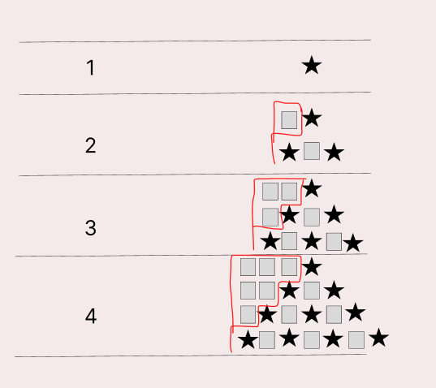

### 문제
예제를 보고 규칙을 유추한 뒤에 별을 찍어 보세요.

### 입력
첫째 줄에 N(1 ≤ N ≤ 100)이 주어진다.

### 출력
첫째 줄부터 N번째 줄까지 차례대로 별을 출력한다.

## 문제해결
이 문제는 2개로 나누어 생각하면 된다. 별 탑의 왼쪽에 채워지는 빈칸에 대한   
규칙과 가운데 출력되는 별 탑에 대한 정보이다.   
먼저 왼쪽 공백에 대한 정보는 입력받는 N -1 부터 시작하여 0까지 출력되는 것을 알 수 있다.
그리고 가운데 별은 공백을 포함하여 2N - 1만큼 증가하는것을 알 수 있다.  
여기서 별은 짝수 번호 찍힌다는 것을 알 수 있다.   
정확히는 인덱스는 0 부터 시작이기 때문에 [0, 2, 4 ..]이런식으로 찍힌다는 규칙을 알 수 있다. 
해당 for문을 코드로 출력하면 아래와 같다.


```java
for(int i = 1; i <= N; i++) {
    for(int j = N; j > i; j--) {
        sb.append(" ");
    }
    for(int j = 0; j < 2 * i -1; j++) {
       if(j % 2 == 0) {
           sb.append("*");
       }
       if(j % 2 == 1) {
           sb.append(" ");
       }
    }
    sb.append("\n");
}
System.out.println(sb);
```