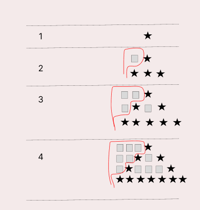

### 문제
예제를 보고 규칙을 유추한 뒤에 별을 찍어 보세요.

### 입력
첫째 줄에 N(1 ≤ N ≤ 100)이 주어진다.

### 출력
첫째 줄부터 N번째 줄까지 차례대로 별을 출력한다.


## 문제해결
이 문제는 몇 가지를 고려해야 한다.   
1. 왼쪽에 찍히는 공백 수
2. 탑의 가장 아랫부분은 공백없이 모두 출력한다.
3. 가장 아랫부분을 제외한 부분에서는 시작과 끝에만 별을 출력한다. 
해당 정보를 갖고 예제 입력을 공백을 채워 그려보면 아래와 같다.

해당 조건을 가지고 for문을 작성하면 아래와 같다.
- 조건을 보면 공백은 N 부터 시작하여 i보다 클 때 까지 출력하여 최대 N - 1개 까지 출력한다.
- 다음으로 별을 찍는 부분인데, 여기서는 i == N 즉, 가장 아래일 경우에는 가운데 공백없이   
- 모두 별을 출력한다.
- 만약 가장 아래가 아니라면 인덱스의 처음 또는 가장 끝 부분일 때 별을 출력하고 나머지는 공백을 출력한다.
- 여기서 2 * i -1 -1 인 이유는
- 별찍는 부분을 보면 공백포함 2N - 1만큼 증가하고 있다.
- 여기서 인덱스는 0부터 시작하기 때문에 -1을 더하게 되어
- (2 * i - 1) - 1 에 별을 찍게 되는 것이다.
```java
for(int i = 1; i <= N; i++) {
    for(int j = N; j > i; j--) {
        sb.append(" ");
    }

    if (i == N) {
        for(int j = 0; j < 2 * i - 1; j++) {
            sb.append("*");
        }
    } else {
        for(int j = 0; j < 2 * i - 1; j++) {
            if(j == 0 || j == 2 * i - 1 - 1) {
                sb.append("*");
            } else {
                sb.append(" ");
            }
        }
    }
    sb.append("\n");
}
System.out.println(sb);
```