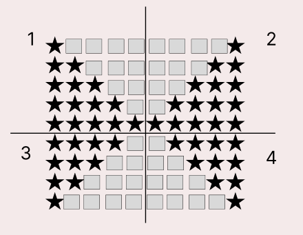

### 문제
예제를 보고 규칙을 유추한 뒤에 별을 찍어 보세요.

### 입력
첫째 줄에 N(1 ≤ N ≤ 100)이 주어진다.

### 출력
첫째 줄부터 2×N-1번째 줄까지 차례대로 별을 출력한다.


## 문제해결
이 문제는 네가지 영역으로 보고 풀면 쉽게 해결할 수 있다.   
먼저 1,2 영역부터 보면 1영역은 별이 1개부터 5개까지 늘어나고 있고, 공백은 4부터 0까지 줄어들고있다.   
2영역은 공백이 4부터 0으로 줄어들고, 영역이 1개부터 5개까지 늘어나고 있다.   
여기서 1,2 영역 두개의 차이는 별이 먼저찍히냐, 아니면 공백이 먼저 찍히냐의 차이이다.    
첫번째 1,2 영역을 찍는 for문은 1부터 N까지 순회하며 해당영역을 출력한다.    
첫 번째 1영역은 j가 i보다 작을때까지 찍으며 j의 초기값은 0이다.   
다음으로 공백은 j가 i보다 클때까지 찍으며 j의 초기값은 N이다.   
그렇다면 2영역은 1영역과 반대로 찍으면 된다.   
2영역의 공백은 j가 i보다 클 때까지 찍으며 j의 초기값은 N이다.   
2영역의 별은 i보다 작을때 까지 찍으며 j의 초기값은 0이다.


다음으로 3,4 영역을 보자면 N -1 만큼 순회하며 출력해야 한다.   
1,2 영역은 5번. 3,4 영역은 4번 찍혀야 완성된다.   
3,4 영역은 1,2영역과 반대로 별이 많이 찍히고 공백이 족게찍히며 감소, 증가해야한다..   
가장 위 for 문은 1 부터 N - 1 까지 순회하며   
3영역은 j의 초기값은 N이며, j는 i보다 클때까지 순회를 돌며 별을 찍는다.   
3영역 공백은 초기값은 j, j는 i보다 작을때 까지 순회하며 출력한다.   
반대로 4영역은 공백을 먼저찍고 다음으로 별을 찍으면 된다.


- N을 입력받는다.
```java
 BufferedReader br = new BufferedReader(new InputStreamReader(System.in));

int N = Integer.parseInt(br.readLine());

StringBuilder sb = new StringBuilder();
```
- 먼저 1,2 영역을 출력한다. 
- 가장 바깥 for 문은 1 ~ N 까지 순회하며 출력한다.
- 1영역을 먼저 보자면 별은 점차 증가하고 공백은 점차 감소한다.
  - 따라서 j는 i보다 작을때 까지 출력하며 j의 초기값은 0이다.
  - 공백은 j가 i보다 클 때까지 출력하며, j의 초기값은 N이다.  
  - 만약 이해 잘 되지 않는다면 for문을 하나하나 씩 생각하며 손으로 작성해보면 충분히 풀 수 있다.
- 2영역은 1영역과 반대로 공백을 먼저 출력하고 별을 출력해주면 된다.
```java
for(int i = 1; i <= N; i++) {
    for(int j = 0; j < i; j++) {
        sb.append("*");
    }

    for(int j = N; j > i; j--) {
        sb.append(" ");
    }

    for(int j = N; j > i; j--) {
        sb.append(" ");
    }

    for(int j = 0; j < i; j++) {
        sb.append("*");
    }

    sb.append("\n");
}
```
- 다음으로 3,4영역은 N - 1 까지 순회하게 된다.
- 1영역과는 반대로 별이 최대에서 점차 줄어들고 공백은 최소에서 점차 증가하는 것이다.  
- 아래 코드를 보면 이해하기 쉬울 것이다.
```java
for(int i = 1; i <= N - 1; i++) {
    for(int j = N; j > i; j--) {
        sb.append("*");
    }

    for(int j = 0; j < i; j++) {
        sb.append(" ");
    }

    for(int j = 0; j < i; j++) {
        sb.append(" ");
    }

    for(int j = N; j > i; j--) {
        sb.append("*");
    }
    sb.append("\n");
}

```
