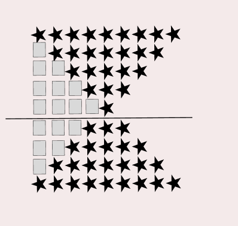

### 문제
예제를 보고 규칙을 유추한 뒤에 별을 찍어 보세요.

### 입력
첫째 줄에 N(1 ≤ N ≤ 100)이 주어진다.

### 출력
첫째 줄부터 2×N-1번째 줄까지 차례대로 별을 출력한다.

## 문제해결
이 문제도 2 영역으로 나누어 해결하면 쉽게 출력할 수 있다.


for문을 정할 때 별의 숫자를 기준으로 돌린다고 생각하면 된다.  
위쪽을 출력할 for문은 초기값은 N, 조건은 0보다 클 때까지 돌면서 출력할 것이다.
이 문제에서는 오른쪽 공백을 고민하지 않아도 된다. 즉, 앞에 공백을 출력할 방법만을 생각한다.   
- 위 부분을 출력하는 코드이다.
```java
for(int i = N; i > 0; i--) {
    for(int j = N; j > i; j--) {
        sb.append(" ");
    }
    for(int j = 0; j < 2 * i - 1; j++) {
        sb.append("*");
    }
    sb.append("\n");
}
```
- 다음을 아래를 출력하는 코드이다.
  - 아래는 N-1 만큼 순회하며, 위와는 반대로 별은 증가하고 공백은 감소한다.
  - i의 초기값은 별의 숫자를 생각하면 된다.
  - 현재 위나 아래의 별의 숫자는 홀수로 증가한다. [2N - 1]
  - 따라서 i의 초기값은 2가 되어야 첫 줄에 3줄이 찍힐 수 있다.
```java
for(int i = 2; i <= N; i++) {
    for(int j = N; j > i; j--) {
        sb.append(" ");
    }
    for(int j = 0; j < 2 * i - 1; j++) {
        sb.append("*");
    }

    sb.append("\n");
}
```