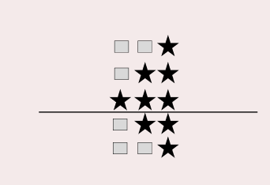

### 문제
예제를 보고 규칙을 유추한 뒤에 별을 찍어 보세요.

### 입력
첫째 줄에 N(1 ≤ N ≤ 100)이 주어진다.

### 출력
첫째 줄부터 2×N-1번째 줄까지 차례대로 별을 출력한다.


## 문제해결
이 문제도 2개의 영역으로 나누어 보면 된다.   
위에 영역은 입력받은 N만큼 순회하고 [1 ~ N]
아래는 N - 1만큼 순회하며 출력하면 된다. [1 ~ N -1]
윗 값은 공백은 점차 줄어들고 별은 점자 층가한다.   
가장 바깥 for문은 i부터 N까지 돌며  내부 공백을 찍는 for문은   
초기값은 N이고, i보다 작을 때 까지 찍으며, 별은 초기값은0 i보다 작을 때 까지 찍으면된다.

```java
for(int i = 1; i <= N; i++) {
    for(int j = N ; j > i; j--) {
        sb.append(" ");
    }

    for(int j = 0; j < i; j++) {
        sb.append("*");
    }
    sb.append("\n");
}
```
아래영역은 N - 1 만큼 순회하며 공백이 점차증가하고 별은 점차 감소한다.
```java
for(int i = 1; i < N; i++) {
    for(int j = 0; j < i; j++) {
        sb.append(" ");
    }

    for(int j = N - 1; j >= i; j--) {
        sb.append("*");
    }
    sb.append("\n");
}

System.out.println(sb);
```